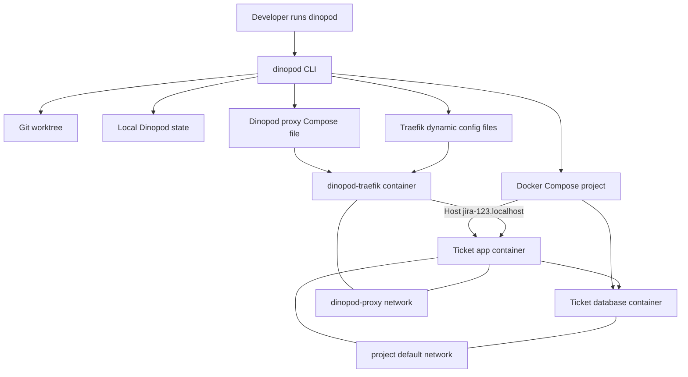
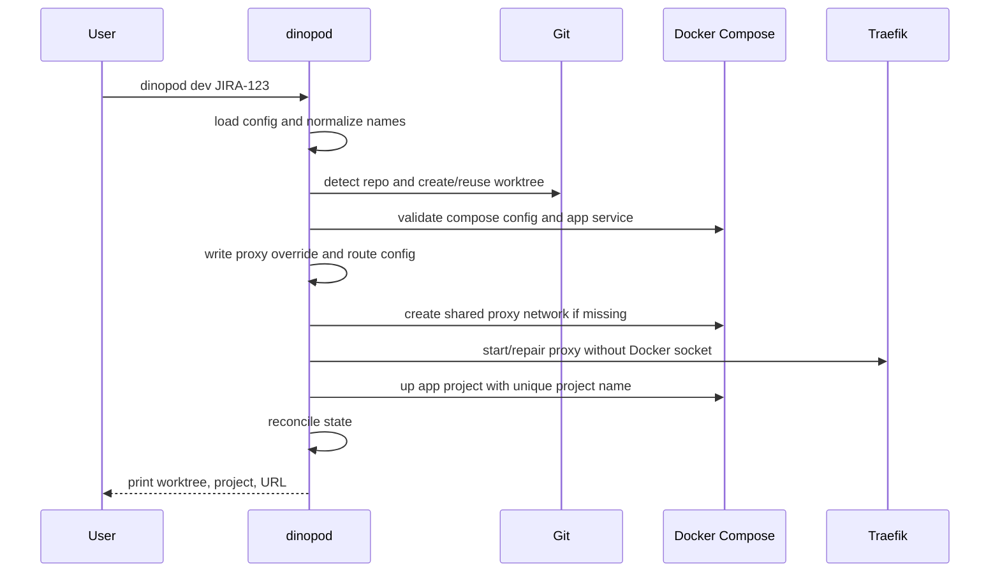
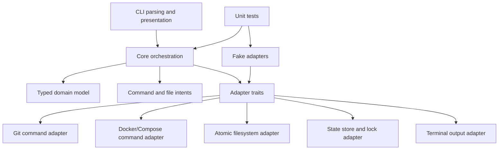

# feat: Build Secure Dinopod MVP Implementation Plan

> **For Claude:** REQUIRED SUB-SKILL: Use superpowers:executing-plans to implement this plan task-by-task.

**Goal:** Build `dinopod`, a Rust CLI that starts isolated per-ticket local development environments with Git worktrees, Docker Compose project isolation, and a shared Traefik proxy configured without Docker socket access.

**Architecture:** Dinopod is a local orchestrator, not a long-running application server. It shells out to `git`, `docker`, and `docker compose`, writes deterministic config artifacts that it owns, and treats Docker/Git as the source of truth while keeping a small local state file for operator convenience.

**Tech Stack:** Rust CLI, `clap`, `serde`, `toml`, `serde_json`, `thiserror` or hand-written `std::error::Error` for internal errors, optional `anyhow` only at the binary/test boundary, `std::process::Command`, Docker Compose, Traefik file provider, Git worktrees.

## Summary

This plan builds the first working Dinopod MVP as a security-conscious Rust CLI. The key implementation shape is: Dinopod creates or reuses a Git worktree, runs the user's Compose app under a unique project name, connects the app to a shared proxy network through a generated Compose override file, and writes explicit Traefik file-provider routes so Traefik never needs Docker socket access.

---

## Problem Frame

Developers working on multiple tickets often need several copies of the same app running at once. Fixed host ports, shared databases, and manual `.env` edits make that workflow fragile. Dinopod's value is making the common path boring: `dinopod dev JIRA-123` and `dinopod dev JIRA-456` should produce two isolated app/database stacks with stable local URLs and no host port collisions.

The original implementation brief proposed Traefik labels and Docker provider discovery. The revised product decision is to keep Traefik for mature proxy behavior, but avoid mounting the Docker socket into the proxy. Dinopod should generate the proxy's routing files itself and keep the external dependency surface narrow, pinned, and auditable.

---

## Requirements

**Core CLI and environment lifecycle**

- R1. `dinopod init` creates a starter `dinopod.toml` with app service, internal port, Compose file, default branch, worktree root, and proxy settings.
- R2. `dinopod dev <ticket>` creates or reuses a deterministic ticket worktree, creates or reuses the branch, starts or repairs the shared proxy, starts the ticket's Compose project, and prints the final local URL.
- R3. Naming is deterministic and collision-resistant for normal use: ticket slug, project name, host, worktree path, proxy alias, state key, and generated route names all derive from the repo name plus ticket unless overridden.
- R4. Running two different tickets for the same repo produces two worktrees, two Compose projects, two app containers, two database containers, separate Compose-scoped volumes, and two working `*.localhost` URLs.
- R5. Re-running `dinopod dev <ticket>` is idempotent: it reuses the existing worktree/branch, refreshes generated Dinopod-owned config, and starts or restarts the Compose project without failing on already-existing resources.
- R6. `dinopod list` shows active Dinopod environments and reconciles local state with Docker/Git rather than trusting stale state blindly.
- R7. `dinopod stop <ticket>`, `dinopod down <ticket>`, and `dinopod rm <ticket>` handle the expected lifecycle boundaries: stop keeps containers and volumes, down removes containers/networks while keeping volumes unless requested, and rm removes the worktree after confirmation.

**Proxy and Compose integration**

- R8. The MVP uses Traefik as a Dinopod-managed Docker container, configured through the file provider with a watched dynamic config directory.
- R9. Traefik must not mount `/var/run/docker.sock` and must not use the Docker provider for MVP routing.
- R10. Dinopod generates explicit Traefik routes mapping each ticket hostname to the ticket app's proxy-network alias and configured internal port.
- R11. Dinopod avoids requiring Traefik labels in the user's Compose file. Instead, it generates a Dinopod-owned Compose override file that attaches the app service to the shared proxy network with a unique alias.
- R12. The user's app service keeps listening on its normal internal port. Dinopod should warn when the resolved Compose config publishes fixed host ports for that app service because fixed host ports can reintroduce collisions.

**Security and supply-chain posture**

- R13. Runtime machine dependencies stay limited to `dinopod`, `git`, `docker`, and `docker compose`; Traefik is pulled only as a pinned Docker image managed by Dinopod.
- R14. The Traefik image is pinned by version and should support digest pinning in config. The generated proxy configuration must make the active image reference visible.
- R15. Rust dependencies stay minimal and must be locked with a committed `Cargo.lock`; CI uses locked builds and dependency policy checks.
- R16. Dinopod should use external release tooling only for build/release automation, not as runtime dependencies.
- R17. The first release path produces prebuilt binaries with checksums and leaves room for Homebrew and shell installer support.

**Error handling and operator feedback**

- R18. Dependency and preflight failures produce actionable errors for missing `git`, missing `docker`, missing `docker compose`, Docker daemon unavailable, not in a Git repo, missing Compose file, missing app service, invalid ticket slug, worktree path conflict, proxy network creation failure, and host port conflicts.
- R19. Commands should print the resolved worktree path, Compose project name, and URL on successful `dev` so users can orient quickly.
- R20. Dinopod should not silently edit user-owned Compose files in the MVP.

**Rust architecture and production readiness**

- R21. Core orchestration logic is testable without Docker or Git by depending on narrow adapter traits for commands, filesystem writes, state storage, and terminal output.
- R22. Domain values that must not be mixed accidentally, such as ticket slug, project name, host name, network alias, and worktree path, use typed wrappers or dedicated structs rather than passing raw strings everywhere.
- R23. User, config, filesystem, Git, Docker, and Compose failures are recoverable errors returned as `Result`, not panics. Panics are reserved for programmer bugs and tests.
- R24. Generated config and state writes are atomic, and commands that mutate shared proxy/state files use an inter-process lock to avoid races between simultaneous Dinopod invocations.
- R25. CI enforces formatting, Clippy, tests, locked dependency resolution, dependency policy checks, and `unsafe_code = "forbid"` unless a future plan explicitly justifies unsafe code.
- R26. Internal APIs use Rust ownership intentionally: prefer `&str`, `&Path`, slices, and borrowed domain values for read-only inputs; clone only at ownership boundaries with a clear reason.
- R27. Adapter abstractions favor static dispatch/generic parameters in core code. Use `dyn Trait` only at API boundaries where runtime polymorphism is actually needed.
- R28. Public modules, public types, and fallible public APIs have rustdoc explaining purpose, invariants, errors, and panics. Public examples should compile as doc tests when practical.
- R29. Tests use descriptive behavior names, target one behavior per test where practical, and keep snapshots small and reviewable if snapshot testing is introduced.

---

## Key Technical Decisions

- **Traefik file provider over Docker provider:** Traefik remains the proxy, but Dinopod generates file-provider routes and does not grant Traefik Docker socket access. This keeps mature proxy behavior while removing the highest-risk default Traefik/Docker integration pattern.
- **Generated Compose override over user Compose mutation:** Dinopod writes an override file it owns and passes it to `docker compose`. This lets Dinopod attach the app service to the shared proxy network and add a network alias without rewriting the user's Compose file.
- **Compose config JSON for validation:** Dinopod should inspect `docker compose config --format json` output for service existence and fixed host ports instead of parsing user YAML directly. This uses Compose's own canonical model and avoids adding a YAML parser dependency for MVP.
- **Local state as cache, not authority:** `~/.config/dinopod/state.toml` can make list and cleanup friendlier, but Docker Compose projects and Git worktrees remain authoritative. Stale state is detected and repaired or ignored.
- **Command runner boundary:** All `git`, `docker`, and `docker compose` calls go through a narrow command-runner abstraction so core logic can be tested without requiring Docker or mutating real repos.
- **Core/adapters boundary:** Keep domain planning and orchestration separate from side-effect adapters. Core code computes environment specs, route specs, command intents, and state transitions; adapters execute commands, write files, acquire locks, and print output.
- **Typed domain values:** Use small newtypes or dedicated structs for normalized names, hosts, aliases, paths, and project identifiers. This follows Rust's type-safety strengths and prevents mixing ticket input, slugs, Compose project names, and Docker aliases.
- **Recoverable error policy:** Library modules return meaningful domain errors; the binary converts them into user-facing messages and exit codes. Use `thiserror` for internal error enums if dependency policy allows it; otherwise hand-write `Display` and `Error`. Use `anyhow` only at the outer CLI or test-helper boundary, not as the internal architecture's error type.
- **Atomic local state and route writes:** Write generated files through temp-file-plus-rename and guard proxy/state mutations with a lock file. Route files and state are shared local infrastructure, so correctness depends on safe concurrent invocation behavior.
- **Borrowing-first API shape:** Functions should accept borrowed inputs for read-only data (`&str`, `&Path`, slices, or references to domain values) and return owned values only when constructing a new artifact. Avoid cloning to satisfy the borrow checker; adjust ownership flow instead.
- **Static dispatch by default:** Adapter traits should be generic in core orchestration and boxed only at CLI/application boundaries if it materially simplifies wiring. This keeps testability without paying unnecessary dynamic dispatch costs.
- **Type-state restraint:** Use type-state only if it makes invalid states unrepresentable without making the API noisy. Good candidates are validated config or validated environment specs; simple lifecycle states can remain enums or explicit results.
- **Documentation as API contract:** Public modules and fallible APIs should document errors, panics, invariants, and usage examples. Prefer rustdoc/doc tests for reusable APIs and concise `// CONTEXT:` comments only for non-obvious local decisions.
- **Performance posture:** Do not micro-optimize before measurement. Rely on Clippy performance lints, avoid redundant clones and needless collections, and benchmark only when the code path is shown to matter.
- **Minimal crate set with policy gates:** Start with `clap`, `serde`, `serde_json`, `toml`, `directories`, and either `thiserror` or manual error implementations. Add `anyhow` only if the CLI boundary needs it. Add `cargo-deny` policy checks early; treat `cargo-vet` and vendoring as stricter follow-up options unless the dependency set grows.
- **HTTP-local MVP:** MVP routing is HTTP on `localhost` hostnames only. HTTPS, mkcert, Portless, LAN sharing, and cloud previews stay out of v1.

---

## High-Level Technical Design

### Runtime Topology



### `dinopod dev` Flow



### Internal Boundary Model



Core modules should be deterministic and easy to test. Side effects stay in adapters, and adapters are thin enough to integration-test directly.

---

## Output Structure

```text
.
|-- Cargo.toml
|-- Cargo.lock
|-- rust-toolchain.toml
|-- deny.toml
|-- src
|   |-- main.rs
|   |-- lib.rs
|   |-- cli.rs
|   |-- cmd.rs
|   |-- compose.rs
|   |-- config.rs
|   |-- domain.rs
|   |-- errors.rs
|   |-- fs.rs
|   |-- git.rs
|   |-- lock.rs
|   |-- names.rs
|   |-- preflight.rs
|   |-- proxy.rs
|   |-- routes.rs
|   |-- state.rs
|   `-- ui.rs
|-- tests
|   |-- architecture.rs
|   |-- cli.rs
|   |-- compose_config.rs
|   |-- fixtures
|   |   `-- basic-compose
|   |       `-- compose.yaml
|   |-- git_worktree.rs
|   |-- names.rs
|   |-- proxy_config.rs
|   `-- state.rs
|-- .github
|   `-- workflows
|       |-- ci.yml
|       `-- release.yml
`-- README.md
```

---

## Implementation Units

### U1. Rust Project Scaffold and Dependency Policy

- **Goal:** Create the Rust CLI package, basic command entrypoint, dependency floor, lockfile, toolchain policy, and dependency audit configuration.
- **Requirements:** R13, R15, R16, R17, R25, R28, R29.
- **Dependencies:** None.
- **Files:**
  - Create: `Cargo.toml`
  - Create: `Cargo.lock`
  - Create: `rust-toolchain.toml`
  - Create: `deny.toml`
  - Create: `src/main.rs`
  - Create: `src/lib.rs`
  - Create: `tests/architecture.rs`
  - Create: `.gitignore`
- **Approach:** Scaffold a single binary package named `dinopod` with testable logic in the library crate and a thin binary entrypoint. Do not introduce a Cargo workspace until there is more than one package to manage. Keep dependencies to the minimal CLI/config/JSON/error set needed for the MVP. Commit `Cargo.lock`, forbid unsafe code through lint configuration, configure Clippy as a hard gate, and configure dependency policy checks for advisories, licenses, duplicate versions, and trusted sources.
- **Execution note:** Add the dependency policy before adding feature modules so dependency creep is visible from the first implementation pass.
- **Patterns to follow:** The repository has no Rust patterns yet; follow idiomatic small-binary crate layout with testable logic in `src/lib.rs` modules and a thin `src/main.rs`.
- **Test scenarios:**
  - Running the binary with no command displays command help rather than panicking.
  - Dependency policy config accepts the initial dependency set and rejects unknown sources.
  - Locked builds work in CI using the committed lockfile.
  - Architecture lint test or CI check fails if unsafe code is introduced.
  - CI runs `cargo clippy --all-targets --all-features --locked -- -D warnings`.
  - Any lint suppression uses local `#[expect(...)]` with a reason, not broad `#[allow(...)]`.
  - Public crate or module docs compile under `cargo test --doc` when examples are added.
- **Verification:** The crate builds, the CLI help renders, the lockfile is present, and dependency policy checks are wired into CI or documented as a local verification command.

### U2. Typed Domain Model, Config Loading, and Deterministic Naming

- **Goal:** Implement typed domain values, `dinopod.toml` loading, defaults, CLI override precedence, and all deterministic naming rules.
- **Requirements:** R1, R3, R18, R21, R22, R26.
- **Dependencies:** U1.
- **Files:**
  - Create: `src/domain.rs`
  - Create: `src/config.rs`
  - Create: `src/names.rs`
  - Create: `tests/names.rs`
  - Create: `tests/config.rs`
- **Approach:** Model config as typed Rust structs with defaults and model derived identifiers as dedicated domain values. Resolve values in this order: CLI flags, `dinopod.toml`, built-in defaults. Keep naming logic pure and heavily tested because every downstream Docker/Git artifact depends on it. Parsing and formatting APIs should borrow source strings and paths where possible, returning owned validated domain values only after validation.
- **Test scenarios:**
  - `JIRA-123` normalizes to `jira-123` for host slugs while preserving the original ticket for branch defaults.
  - Invalid characters collapse into single dashes and leading/trailing dashes are trimmed.
  - Empty normalized ticket values return a clear error.
  - Repo name plus ticket produces a valid Compose project name starting with a lowercase letter or digit.
  - Host, project name, alias, and worktree path cannot be accidentally interchanged through a shared raw-string API.
  - Naming functions accept borrowed inputs and do not require callers to allocate `String` values for read-only parsing.
  - CLI overrides replace config values without mutating the loaded config file.
  - Missing config fields fall back to defaults.
- **Verification:** Naming and config tests cover representative tickets, pathological input, and override precedence.

### U3. Command Runner, Preflight Checks, Error Model, and Output Boundary

- **Goal:** Create testable boundaries for command execution, terminal output, recoverable errors, and preflight checks for machine dependencies, Git repository context, Docker daemon availability, Compose availability, and port conflicts.
- **Requirements:** R13, R18, R19, R21, R23, R27, R28.
- **Dependencies:** U1, U2.
- **Files:**
  - Create: `src/cmd.rs`
  - Create: `src/preflight.rs`
  - Create: `src/errors.rs`
  - Create: `src/ui.rs`
  - Create: `tests/cli.rs`
- **Approach:** Wrap command execution in a small interface that records command, working directory, environment, stdout, stderr, and exit status. Define meaningful internal error enums for expected failure classes and convert them to user-facing output only at the CLI boundary. Prefer generic/static-dispatch adapter parameters in core orchestration; introduce trait objects only at the final application wiring boundary if they clearly reduce complexity.
- **Test scenarios:**
  - Missing `git` returns an actionable dependency error.
  - Missing `docker` returns an actionable dependency error.
  - Missing `docker compose` returns an actionable dependency error.
  - Docker daemon failure is distinguished from Docker binary absence.
  - Not being inside a Git repo is reported before worktree or Docker operations.
  - Port 80 in use by a healthy Dinopod proxy is treated as proxy reuse, while port 80 in use by another process reports a proxy-specific conflict and does not continue to start app containers.
  - Recoverable command/config/input failures return errors without panicking.
  - Successful user-facing messages are written through the output boundary, not directly from core orchestration modules.
  - Internal modules do not use `unwrap()` or `expect()` for recoverable command, config, or filesystem failures.
  - Adapter traits can be exercised with fake implementations without requiring boxed trait objects inside core logic.
- **Verification:** Preflight tests exercise each failure path without requiring Docker to be installed on the test host.

### U4. Git Worktree Lifecycle

- **Goal:** Implement repo detection, branch existence checks, worktree creation/reuse, and worktree conflict handling.
- **Requirements:** R2, R3, R5, R7, R18, R19.
- **Dependencies:** U2, U3.
- **Files:**
  - Create: `src/git.rs`
  - Create: `tests/git_worktree.rs`
- **Approach:** Use Git as the source of truth through `git rev-parse`, `git worktree list --porcelain`, and branch reference checks. Make existing branch/worktree cases idempotent. Treat a path that exists but is not the expected worktree as a hard error.
- **Test scenarios:**
  - New ticket with no branch emits a branch-creation worktree command based on the configured base branch.
  - Existing local branch emits a worktree-add command without branch creation.
  - Existing matching worktree is reused and not recreated.
  - Running from inside a worktree still resolves the root repo consistently.
  - Existing non-worktree path at the target location returns a clear conflict error.
  - Dirty current worktree is allowed when creating a separate ticket worktree, with a warning rather than a hard failure.
- **Verification:** Fake-runner tests prove command selection for branch/worktree states; a narrow integration test may use a temporary Git repo when available.

### U5. Compose Validation and Dinopod Override Generation

- **Goal:** Validate the user's Compose app service and generate the Dinopod-owned override file that joins the app to the shared proxy network with a unique alias.
- **Requirements:** R2, R4, R10, R11, R12, R18, R20.
- **Dependencies:** U2, U3.
- **Files:**
  - Create: `src/compose.rs`
  - Create: `tests/compose_config.rs`
  - Create: `tests/fixtures/basic-compose/compose.yaml`
- **Approach:** Use `docker compose config --format json` as the canonical Compose inspection source. Generate a small override file from trusted Dinopod values instead of parsing or rewriting user YAML. Pass the user Compose file and Dinopod override file together for every app lifecycle command.
- **Technical design:** The override file should add only the configured app service network attachment and the shared external network definition. Keep service name, internal app port, and network alias derived from validated config/names.
- **Test scenarios:**
  - Missing Compose file returns a clear error.
  - Missing app service returns a clear error naming the configured service.
  - App service with fixed host port produces a warning and still allows MVP startup unless another preflight blocks it.
  - Generated override attaches only the app service to the shared proxy network.
  - Generated override preserves any pre-existing app service networks, so app-to-database connectivity is not broken when the user's Compose file already defines explicit networks.
  - Generated override uses a unique proxy-network alias per repo/ticket.
  - Compose command construction includes both the user's Compose file and Dinopod's override file.
- **Verification:** Unit tests snapshot the generated override content and validate JSON config inspection against fixture output.

### U6. Shared Traefik Proxy Lifecycle and Route Files

- **Goal:** Start, repair, stop, and configure the shared Traefik proxy using the file provider with no Docker socket mount.
- **Requirements:** R8, R9, R10, R13, R14, R18, R21, R24, R26.
- **Dependencies:** U2, U3, U5.
- **Files:**
  - Create: `src/fs.rs`
  - Create: `src/lock.rs`
  - Create: `src/proxy.rs`
  - Create: `src/routes.rs`
  - Create: `tests/proxy_config.rs`
- **Approach:** Store Dinopod proxy assets under the user's config directory. Generate a proxy Compose file for the Traefik container and a dynamic config directory for routes. Start Traefik on the shared network, mount the dynamic config directory read-only, enable file-provider watch, expose only the configured HTTP port, and never mount the Docker socket.
- **Technical design:** Each environment route is a TOML dynamic config file owned by Dinopod. The service URL should target the app's proxy-network alias and configured internal port. Route and proxy config writes should be atomic, and proxy mutations should hold the Dinopod lock so concurrent `dev`, `down`, or `rm` commands cannot interleave partial route updates.
- **Test scenarios:**
  - Generated proxy Compose file contains no Docker socket volume.
  - Generated proxy Compose file uses the configured Traefik image reference and HTTP port.
  - Generated proxy Compose file uses a digest-pinned Traefik image when config provides one.
  - Dynamic route file maps `jira-123.localhost` to the expected proxy alias and internal port.
  - Route writes are atomic: a simulated write failure leaves the previous route file intact.
  - Concurrent proxy mutations serialize through the lock.
  - Route generation avoids unnecessary intermediate collections and repeated string allocations in loops over environments.
  - Starting the proxy creates the shared network if absent.
  - Existing healthy proxy is reused.
  - Proxy container with wrong image/config is reported as needing repair rather than silently ignored.
- **Verification:** Proxy generation tests prove no Docker provider/socket configuration is emitted; fake-runner tests cover network creation and proxy start/repair command selection.

### U7. Environment State and Lifecycle Commands

- **Goal:** Implement `dev`, `list`, `stop`, `down`, and `rm` end to end using Git, Compose, proxy routes, and local state reconciliation.
- **Requirements:** R2, R4, R5, R6, R7, R18, R19, R20, R21, R23, R24, R29.
- **Dependencies:** U2, U3, U4, U5, U6.
- **Files:**
  - Create: `src/cli.rs`
  - Create: `src/state.rs`
  - Create: `tests/state.rs`
  - Modify: `src/main.rs`
  - Modify: `src/lib.rs`
- **Approach:** Keep CLI parsing separate from orchestration. `dev` coordinates all subsystems and writes state only after the environment is materially created or refreshed. `list` reconciles state with Compose/Git. `stop`, `down`, and `rm` remove route files at the right lifecycle boundary so proxy routing does not point at dead environments. Shared state changes should be atomic and guarded by the same lock used for proxy mutations.
- **Test scenarios:**
  - `dev` happy path calls worktree setup, override generation, route generation, proxy start, Compose up, and state update in order.
  - `dev` rerun for the same ticket refreshes config and prints the same URL.
  - `list` marks missing Docker projects as stopped or stale rather than reporting them as running.
  - `stop` keeps state and route metadata sufficient for a later `dev` rerun.
  - `down` without volumes preserves volume data intent.
  - `down --volumes` removes Compose volumes for the project.
  - `rm` requires confirmation unless forced, removes the route, downs the project, and removes the worktree.
  - A simulated state-write failure does not corrupt existing state.
  - Two simultaneous lifecycle commands cannot corrupt route or state files.
  - Lifecycle tests use descriptive behavior names and isolate one behavior per test where practical.
- **Verification:** CLI integration tests use fake runners and temporary state directories to validate command orchestration and state transitions.

### U8. End-to-End Docker Smoke Tests

- **Goal:** Add optional Docker-backed smoke coverage for the core success path with a fixture Compose app.
- **Requirements:** R2, R4, R5, R8, R10, R11, R12, R18.
- **Dependencies:** U7.
- **Files:**
  - Create: `tests/e2e.rs`
  - Modify: `tests/fixtures/basic-compose/compose.yaml`
  - Modify: `README.md`
- **Approach:** Keep Docker E2E tests opt-in or CI-gated because not every contributor environment has Docker available. Use the smallest possible fixture app and database substitute needed to prove two projects can start concurrently and route through the shared proxy. The smoke test should clean up its projects, route files, and worktrees.
- **Test scenarios:**
  - Two ticket environments start concurrently with unique project names and unique URLs.
  - Both environments answer through Traefik on their expected hostnames.
  - Each ticket environment has a distinct database container and project-scoped database volume.
  - Re-running `dev` for an existing ticket is idempotent.
  - A fixture Compose file with a fixed host port triggers the expected warning.
  - Cleanup removes route files and Compose resources created by the smoke test.
  - Any snapshots for generated config or CLI output are small, named, committed, and reviewed intentionally.
- **Verification:** Maintainers can run the E2E suite locally when Docker is available; CI may run it on a dedicated job if the runner supports Docker reliably.

### U9. CI, Release, and Installer Readiness

- **Goal:** Add CI, release configuration, checksum-oriented artifact publishing, and documentation for the first binary distribution path.
- **Requirements:** R15, R16, R17, R25.
- **Dependencies:** U1, U7.
- **Files:**
  - Create: `.github/workflows/ci.yml`
  - Create: `.github/workflows/release.yml`
  - Modify: `Cargo.toml`
  - Create: `README.md`
- **Approach:** CI should run formatting, Clippy, tests, doc tests, locked builds, and dependency policy checks. Release automation can use `cargo-dist` or equivalent tooling to produce platform archives, checksums, and a future Homebrew/shell installer path. Keep npm wrapper work out of the MVP implementation unless release packaging is already stable.
- **Test scenarios:**
  - CI fails if the lockfile is missing or outdated.
  - CI fails on formatting or Clippy violations.
  - CI fails when dependency policy checks fail.
  - CI fails if unsafe code appears without an explicit future plan changing the lint policy.
  - CI fails when public rustdoc examples no longer compile.
  - Release configuration names the expected binary and target artifacts.
  - README install guidance distinguishes prebuilt binaries from contributor-oriented `cargo install`.
- **Verification:** A dry-run release or generated release manifest shows the intended artifacts and checksum outputs before tagging the first release.

### U10. User Documentation and Compose Migration Guidance

- **Goal:** Document the user-facing workflow, required Compose shape, warnings, cleanup semantics, and security posture.
- **Requirements:** R1, R2, R4, R8, R9, R12, R13, R14, R18, R19, R20.
- **Dependencies:** U7, U9.
- **Files:**
  - Modify: `README.md`
  - Modify: `DINOPOD_IMPLEMENTATION_PLAN.md`
- **Approach:** Make the README practical: install, initialize, run two tickets, list, stop, down, rm, troubleshoot Docker/port/proxy issues. Explain that Dinopod uses Traefik file-provider config without Docker socket access. Update the implementation brief or add a short note so it no longer suggests Traefik Docker labels as the MVP default.
- **Test scenarios:**
  - README examples match the CLI command names and config fields implemented.
  - Compose guidance shows no required Traefik labels.
  - Troubleshooting includes fixed host ports, Docker daemon unavailable, port 80 conflicts, and stale state.
  - Security section names the pinned Traefik image, no Docker socket mount, committed `Cargo.lock`, and dependency policy checks.
- **Verification:** A new reader can follow the README to understand the MVP workflow and the revised proxy design without needing the original planning conversation.

---

## Scope Boundaries

### Deferred to Follow-Up Work

- Custom Dinopod-owned Rust proxy.
- HTTPS automation, mkcert integration, Traefik TLS, and local certificate management.
- Portless backend for non-Docker processes, HTTPS-first workflows, or LAN sharing.
- `dinopod doctor --fix` that rewrites or repairs user Compose files.
- npm wrapper package and `npx dinopod` convenience path.
- `dinopod open`, `dinopod logs`, richer `doctor`, GUI/TUI, and remote preview environments.
- Vendored dependency mode or `cargo-vet` as a hard gate if the dependency surface grows beyond the MVP baseline.

### Outside This MVP

- Kubernetes support.
- Cloud preview environments.
- Team sharing.
- Authentication.
- Secrets manager integration.
- Production database cloning.
- Devcontainer orchestration.
- Full Compose parser/rewriter owned by Dinopod.

---

## System-Wide Impact

- Dinopod becomes the owner of generated local infrastructure under the user's config directory and ticket worktree. Generated files must be clearly named and safe to delete.
- The proxy security boundary changes from Traefik discovering containers through Docker API access to Dinopod explicitly writing routes. This makes route generation and cleanup part of Dinopod's correctness surface.
- The user's Compose project remains source-owned. Dinopod should layer override files on top rather than mutating the app's checked-in Compose file.
- Docker Compose project names become the isolation boundary for containers, networks, and volumes. Name normalization must preserve Compose's constraints and stay stable across releases.

---

## Risks & Dependencies

- **Traefik image trust:** Even without Docker socket access, Traefik is still a third-party image. Pin by version, support digest pinning, and document how the active image is configured.
- **Compose override merge behavior:** Dinopod relies on Compose merging the generated override with the user file. Tests should cover the generated override shape and smoke-test one realistic fixture.
- **Port 80 availability:** Host port conflicts are common. MVP should detect and explain the conflict; alternate port orchestration can come later.
- **Docker Desktop differences:** macOS, Linux, and Windows can differ in networking behavior. Keep the MVP path on `localhost` hostnames and Docker bridge networks, and avoid assumptions about host networking.
- **Stale route files:** If route cleanup fails, Traefik may keep routing to a dead alias. Lifecycle commands should remove route files and `dev` should overwrite them deterministically.
- **Concurrent local commands:** Two shells can run Dinopod at the same time. Atomic writes and a lock file are required so route/state updates do not corrupt each other.
- **Raw-string drift:** A CLI orchestrator has many similar identifiers. Typed domain values reduce the chance of sending a host where a project name or alias was required.
- **Rust anti-pattern drift:** The implementation can degrade through clone-heavy ownership workarounds, unchecked `unwrap()`, broad lint suppression, or premature boxing. CI and review should treat these as design issues, not style nits.
- **Worktree path conflicts:** Worktree roots outside the repo are convenient but can collide with existing directories. Treat unexpected paths as hard errors.

---

## Documentation / Operational Notes

- The README should call out the revised proxy model explicitly: Traefik file provider, no Docker socket, no app labels required.
- The CLI should print enough success detail for users to debug quickly: worktree path, Compose project name, and URL.
- Generated files should include short comments identifying Dinopod ownership where the target format supports comments.
- Public modules and fallible APIs should document error behavior. Examples should use `?` instead of `unwrap`.
- Test modules should group behavior by unit of work and use names that read like the behavior being specified.
- Avoid long explanatory comments for ordinary control flow; prefer smaller functions, named domain types, rustdoc, or an ADR/design doc when the context must persist.
- Release documentation should distinguish runtime dependencies from contributor/release dependencies.

---

## Sources & Research

- `DINOPOD_IMPLEMENTATION_PLAN.md` - original product and implementation brief.
- Docker Compose project names isolate resources and can be set explicitly through `-p` or `COMPOSE_PROJECT_NAME`: https://docs.docker.com/compose/how-tos/project-name/
- Docker Compose networks and external network references shape the shared proxy network design: https://docs.docker.com/reference/compose-file/networks/
- Docker Compose service aliases are network-scoped and can provide the per-ticket proxy target name: https://docs.docker.com/reference/compose-file/services/
- Docker Compose config can render the canonical model as JSON, which supports validation without parsing user YAML directly: https://docs.docker.com/reference/cli/docker/compose/config/
- Traefik file provider supports explicit dynamic routing files and watched directories: https://doc.traefik.io/traefik/v3.6/reference/routing-configuration/other-providers/file/
- Traefik Docker provider requires Docker API/socket access for dynamic configuration and documents the security concern: https://doc.traefik.io/traefik/v3.6/reference/install-configuration/providers/docker/
- Cargo recommends checking in `Cargo.lock` when in doubt and uses it for reproducible dependency resolution: https://doc.rust-lang.org/cargo/guide/cargo-toml-vs-cargo-lock.html
- Cargo supports locked and offline/frozen modes for deterministic builds: https://doc.rust-lang.org/cargo/commands/cargo-generate-lockfile.html
- Cargo vendor supports local vendoring if the project later chooses stricter source control: https://doc.rust-lang.org/cargo/commands/cargo-vendor.html
- `cargo-deny` can check advisories, licenses, duplicate/banned crates, and trusted sources: https://github.com/EmbarkStudios/cargo-deny
- `cargo-vet` is available as a stricter third-party dependency audit workflow if needed later: https://github.com/mozilla/cargo-vet
- `cargo-dist` can produce GitHub Release artifacts, installers, and checksums for binary distribution: https://axodotdev.github.io/cargo-dist/book/
- Rust's standard error model distinguishes recoverable `Result` errors from unrecoverable panics: https://doc.rust-lang.org/book/ch09-00-error-handling.html
- Cargo supports package/workspace lint configuration, including forbidding unsafe code: https://doc.rust-lang.org/cargo/reference/workspaces.html
- Clippy catches common mistakes and improves Rust code quality: https://doc.rust-lang.org/cargo/commands/cargo-clippy.html
- Rust API Guidelines recommend meaningful error types, type-safe newtypes, common trait implementations, and documented failure behavior: https://rust-lang.github.io/api-guidelines/checklist.html
