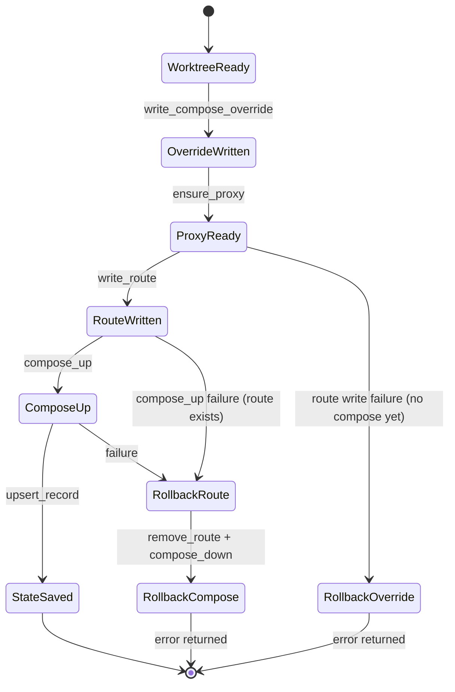

# refactor: Resolve PR #1 thermo-nuclear review findings

## Summary

This plan closes every actionable finding from the thermo-nuclear code review of [PR #1](https://github.com/dinogomez/dinopod/pull/1). Work splits into two tracks: **PR hygiene** (strip non-product artifacts so the MVP is reviewable on its own) and **correctness/hardening** (transactional `dev`, consistent Git/Docker compose file usage, honest lock semantics, and structural simplifications). Decisions where the review offered options use best-judgment defaults documented below — no further user input required.

---

## Problem Frame

PR #1 ships a solid ~5k-line Rust CLI but presents ~10k lines to reviewers because agent skills, planning archives, and duplicate docs ride along. Inside the product code, `dev` can leave orphan containers, `remove_worktree` uses the wrong Git working directory, stop/down omit compose files that `up` used, and `list` mutates state on a read command. Helper duplication and unused API surface (`ConfigOverrides`) add maintenance cost without user value.

The MVP architecture (ports/traits, atomic writes, no Docker socket) stays. This plan fixes gaps without re-litigating product scope.

---

## Requirements

- R1. PR #1 review surface is limited to product code, CI, README, deny policy, and minimal agent pointer — agent skill vendoring moves to a follow-up PR.
- R2. `dinopod dev` failure after partial progress rolls back or compensates so no untracked running containers remain without a route/state record.
- R3. All Git worktree mutations run with `repo_root` as working directory, consistent with `GitWorktreeManager`.
- R4. `compose stop`, `compose down`, and `compose up` use the same compose file pair stored in environment state.
- R5. `dinopod list` is read-only by default; `--reconcile` opt-in updates stale status in state.
- R6. Shared command error helpers and path display helpers exist in one canonical module — no triplication.
- R7. Unused `ConfigOverrides` API is removed until CLI flags are product-required.
- R8. Domain newtypes are constructible only through validated normalization (`TryFrom` / fallible constructors), not public `new(String)`.
- R9. Ticket/host slug validation rejects characters that could break Traefik rule syntax.
- R10. Lock documentation and naming reflect actual semantics (create-new file guard, stale recovery, TOCTOU caveat); optional `flock` upgrade deferred unless trivial on all target platforms.
- R11. `Cargo.toml` `repository` URL matches `dinogomez/dinopod`.
- R12. `main.rs` delegates lifecycle setup to a small `AppContext` (or equivalent) so command handlers stay thin.
- R13. All new failure paths have unit tests; existing test suite stays green.

**Origin actors:** Developer (CLI operator), Reviewer (PR auditor)
**Origin flows:** F-dev (create environment), F-list (inspect environments), F-teardown (stop/down/rm)
**Origin acceptance examples:** AE-dev-success, AE-dev-compose-fail-no-orphans, AE-list-readonly

---

## Scope Boundaries

- No new CLI subcommands beyond `--reconcile` on `list`.
- No wiring of ten `ConfigOverrides` flags in this pass (YAGNI).
- No `flock`/`fcntl` rewrite unless spike proves cross-platform cost is negligible — document honestly instead.
- No split of `CommandLifecyclePorts` into three adapters unless implementation reveals clear seams during U4.
- No changes to Traefik routing model (network alias as upstream) — only input validation.

### Deferred to Follow-Up Work

- **Agent skills vendoring** (`.agents/skills/`, `skills-lock.json`): separate PR after MVP merges — keeps review focused.
- **`DINOPOD_IMPLEMENTATION_PLAN.md` removal or relocation**: follow-up docs PR; this plan only stops adding duplicate planning artifacts to the MVP PR.
- **CLI override flags** (`--service`, `--port`, etc.): future feat when users request them.
- **True advisory file locking (`flock`)**: follow-up if concurrent dinopod usage becomes a reported problem.

---

## Context & Research

### Relevant Code and Patterns

- Lifecycle orchestration: `src/lifecycle.rs` — `LifecyclePorts` trait, `dev`/`list`/`stop`/`down`/`rm`
- Production adapters: `src/runtime.rs` — `CommandLifecyclePorts`, compose/git/docker calls
- State model: `src/state.rs` — `EnvironmentRecord`, `FileStateStore`
- Git: `src/git.rs` — `GitWorktreeManager`, always uses explicit `current_dir`
- CLI entry: `src/main.rs` — `LifecycleMode`, `with_lifecycle`, preflight branching
- Command boundary: `src/cmd.rs` — `CommandRunner`, `CommandSpec`, `CommandOutput`
- Names/domain: `src/names.rs`, `src/domain.rs` — slug normalization and newtypes
- Existing failure test: `tests/state.rs` — `dev_should_not_leave_route_or_state_when_compose_up_fails`
- Route atomicity test: `tests/proxy_config.rs` — `atomic_route_write_failure_should_leave_previous_route_intact`

### Institutional Learnings

- No prior `docs/solutions/` entries in this repo.

### External References

- Thermo-nuclear review (session): PR #1 findings list
- Origin MVP plan: `docs/plans/2026-05-28-001-feat-dinopod-secure-mvp-plan.md` (R22 typed domain values, R24 atomic writes + lock)

---

## Key Technical Decisions

| Decision | Choice | Rationale |
|----------|--------|-----------|
| ConfigOverrides | **Delete** API and tests | Unused; wiring 10 flags expands scope without user demand |
| Domain newtypes | **Strengthen** with fallible constructors | Honors origin R22; removes "identity wrapper" smell |
| `list` behavior | **Read-only default + `--reconcile`** | Surprising writes on `list` violate operator expectations |
| PR split | **Move skills to follow-up PR** | Unblocks MVP review; skills aren't runtime dependencies |
| `dev` atomicity | **Compensating rollback** on downstream failure | Simpler than two-phase commit; matches existing port trait |
| Compose file storage | **Extend `EnvironmentRecord`** with compose paths | Single source of truth for up/stop/down/rm |
| Lock semantics | **Rename + document** (`MutationGuard`), defer `flock` | Honest about TOCTOU; true flock is follow-up |
| Error helpers | **Centralize in `src/cmd.rs`** | Canonical layer for command failures |
| `main.rs` cleanup | **`AppContext::from_env()`** | One setup path; deletes `LifecycleMode` scatter |

---

## Open Questions

### Resolved During Planning

- **ConfigOverrides?** Delete until CLI flags are requested.
- **Newtypes?** Strengthen at normalization boundary; do not remove (origin R22).
- **List reconcile?** Opt-in `--reconcile` flag.

### Deferred to Implementation

- **Exact rollback order when route write fails after compose up:** Implementer validates against Docker label behavior on target platforms; test with fake ports first.
- **`flock` feasibility on Windows:** Only investigate if U7 documentation pass suggests easy win; otherwise stay with documented create-new guard.

---

## High-Level Technical Design

> *This illustrates the intended approach and is directional guidance for review, not implementation specification. The implementing agent should treat it as context, not code to reproduce.*

### Transactional `dev` (compensating actions)

**Reorder rationale:** Write Traefik route *before* `compose_up` so the proxy can route as soon as containers start. On compose failure, remove route (already tested pattern in `tests/proxy_config.rs`). On compose success but state save failure, leave route + running containers but return error — document as known edge case OR add state-save retry; prefer retry once then error with message telling user to run `list --reconcile`.

### `EnvironmentRecord` extension

Add fields (names illustrative):

- `user_compose_file: PathBuf` — path inside worktree
- `compose_override_file: PathBuf` — `.dinopod/compose.override.yml`

All compose commands build `ComposeFiles` from stored paths, not re-derived paths that could drift.

---

## Implementation Units

- U1. **PR hygiene — strip non-product artifacts from MVP branch**

**Goal:** Reduce PR #1 diff to reviewable product scope.

**Requirements:** R1

**Dependencies:** None

**Files:**
- Modify: `.gitignore` (if skills moved out, ensure no broken refs in AGENTS.md)
- Modify: `AGENTS.md` (pointer to install skills separately, not vendored)
- Delete from MVP PR branch: `.agents/skills/**`, `skills-lock.json`, `DINOPOD_IMPLEMENTATION_PLAN.md`
- Keep: `docs/plans/2026-05-28-001-feat-dinopod-secure-mvp-plan.md`, this plan file

**Approach:**
- Remove vendored skill tree from the feat branch; open follow-up PR or issue for agent skills.
- Keep a one-line AGENTS.md note: skills can be installed via existing lock workflow when needed.
- Do not delete historical plan in `docs/plans/` — it documents MVP intent.

**Test scenarios:**
- Test expectation: none — file deletion and doc edit only

**Verification:**
- `git diff --stat` against `main` excludes `.agents/` and root implementation plan
- README and CI unchanged functionally

---

- U2. **Centralize command error helpers and path display**

**Goal:** One canonical implementation for docker/git command failure mapping and path args.

**Requirements:** R6

**Dependencies:** None

**Files:**
- Modify: `src/cmd.rs` (add `command_failed` helpers and `path_display`)
- Modify: `src/runtime.rs`, `src/proxy.rs`, `src/git.rs`, `src/compose.rs` (delete local duplicates, import canonical)
- Test: `tests/cmd.rs`

**Approach:**
- Add functions on `CommandOutput` or free functions in `cmd` module: `docker_command_failed`, `git_command_failed`, `path_display(&Path) -> String`.
- Re-export or use via `crate::cmd::` from adapters.

**Test scenarios:**
- Happy path: existing cmd tests still pass
- Error path: unit test that failed `CommandOutput` maps to correct `DinopodError` variant with args/stderr preserved

**Verification:**
- `rg 'fn docker_command_failed|fn git_command_failed|fn path_arg' src/` returns only canonical location(s)
- `cargo test --all --locked` green

---

- U3. **Remove unused ConfigOverrides**

**Goal:** Delete dead configuration API.

**Requirements:** R7

**Dependencies:** None

**Files:**
- Modify: `src/config.rs`
- Modify: `tests/config.rs`

**Approach:**
- Remove `ConfigOverrides` struct and `with_overrides` method.
- Remove or rewrite config test that only exercised overrides.

**Test scenarios:**
- Happy path: default config merge from partial TOML still works
- Test expectation: none for override-specific cases (removed)

**Verification:**
- `rg ConfigOverrides` returns no matches
- Config tests pass

---

- U4. **Strengthen domain newtypes and slug validation**

**Goal:** Newtypes only built through validated normalization; reject Traefik-unsafe slug characters.

**Requirements:** R8, R9

**Dependencies:** None

**Files:**
- Modify: `src/domain.rs`
- Modify: `src/names.rs`
- Modify: `src/errors.rs` (or `names.rs` `NameError`) for new validation errors
- Modify: `src/routes.rs` (consume validated `HostName` only)
- Test: `tests/names.rs`

**Approach:**
- Replace public `new(String)` with `try_from_normalized` or make constructors `pub(crate)` and expose only via `normalize_slug` / `derive_names`.
- Add explicit reject list for host rule metacharacters: backtick, parens, quotes, spaces, `||`, etc.
- Map validation failure to existing `NameError` or new variant with actionable message.

**Test scenarios:**
- Happy path: `JIRA-123` normalizes to `jira-123` host
- Edge case: empty ticket after normalization fails
- Error path: ticket containing backticks or `Host(` substring rejected
- Edge case: repo name with special chars normalizes safely

**Verification:**
- Cannot construct `HostName` from arbitrary string in public API
- Names tests cover rejection cases

---

- U5. **Extend state with compose paths; unify compose commands**

**Goal:** stop/down/up use identical compose file pair from state.

**Requirements:** R4

**Dependencies:** U6 (record populated during dev)

**Files:**
- Modify: `src/state.rs`
- Modify: `src/lifecycle.rs` (`EnvironmentRecord` creation in `environment_spec`)
- Modify: `src/runtime.rs` (`compose_stop`, `compose_down`, `compose_up` paths)
- Test: `tests/state.rs`, `tests/runtime.rs`

**Approach:**
- Add `user_compose_file` and `compose_override_file` to `EnvironmentRecord` (serde fields, kebab-case keys).
- Migration: if fields missing in old state files, derive paths using current config + worktree path on load (one-time fallback).
- `compose_stop`/`compose_down`: pass `-f` twice like `compose_up`.

**Test scenarios:**
- Happy path: dev record includes both compose paths
- Integration: fake ports record shows stop/down commands include same `-f` args as up
- Edge case: load legacy state without new fields — fallback derivation succeeds

**Verification:**
- Recording runner tests assert compose file args on stop/down match up

---

- U6. **Transactional dev lifecycle with compensating rollback**

**Goal:** No orphan containers without route/state; route written before compose up.

**Requirements:** R2

**Dependencies:** U5

**Files:**
- Modify: `src/lifecycle.rs`
- Modify: `src/runtime.rs` (if rollback needs new port methods)
- Modify: `src/lifecycle.rs` `LifecyclePorts` (add `compose_down` rollback support if not already sufficient)
- Test: `tests/state.rs`

**Approach:**
- Reorder `dev`: worktree → override → proxy → **route** → compose_up → state.
- On `compose_up` failure: `remove_route`, optionally `compose_down` if partial start detected.
- On state save failure after success: retry once; if still failing, return error with message referencing `list --reconcile` and printed project name.
- Add tests mirroring existing compose-fail test plus route-fail and state-fail cases.

**Execution note:** Add failing tests for new failure paths before reordering implementation.

**Test scenarios:**
- Covers AE-dev-compose-fail-no-orphans: compose_up fails → no state, route removed
- Error path: route write fails → no compose_up call
- Error path: compose_up succeeds, state save fails → error returned; document container still running
- Happy path: full dev still produces same call order aside from route-before-compose

**Verification:**
- All lifecycle tests pass including new failure cases
- Call order assertions updated in `dev_should_orchestrate_environment_creation_and_write_state`

---

- U7. **Fix remove_worktree cwd; honest lock naming**

**Goal:** Git worktree remove uses repo root; lock docs match behavior.

**Requirements:** R3, R10

**Dependencies:** U2

**Files:**
- Modify: `src/runtime.rs` (`remove_worktree` — pass repo_root through ports)
- Modify: `src/lifecycle.rs` (`LifecyclePorts::remove_worktree` signature add `repo_root` OR store repo_root on manager)
- Modify: `src/lock.rs` (rename type/doc comments)
- Modify: `README.md` (lock semantics one sentence)
- Test: `tests/runtime.rs` or `tests/git_worktree.rs`

**Approach:**
- Extend `remove_worktree(&self, repo_root: &Path, path: &Path)` on trait and all fakes.
- Rename `FileLock` → `MutationGuard` (or keep type, update module docs) explaining create-new + stale recovery + TOCTOU.
- Do not claim "lock-protected" in README without caveat.

**Test scenarios:**
- Integration: recording git commands show `current_dir` = repo_root for worktree remove
- Test expectation: none for rename-only doc changes beyond compile

**Verification:**
- Fake CLI/subdir test pattern from `tests/cli.rs` still passes for rm flow

---

- U8. **Read-only list with --reconcile flag**

**Goal:** Default list does not write state; reconcile is explicit.

**Requirements:** R5

**Dependencies:** U5

**Files:**
- Modify: `src/cli.rs` (add `--reconcile` to List)
- Modify: `src/lifecycle.rs` (split `list` vs `reconcile_list` or parameter)
- Modify: `src/main.rs`
- Test: `tests/cli.rs`, `tests/state.rs`

**Approach:**
- `list(reconcile: bool)` — when false, load and return records without save.
- When true, existing stale detection + save.
- Update help text and README lifecycle section.

**Test scenarios:**
- Covers AE-list-readonly: list without flag does not modify state file mtime/content
- Happy path: `list --reconcile` marks stale when docker project gone
- Edge case: list with reconcile and empty state — no error

**Verification:**
- CLI test asserts state file unchanged on plain `list`

---

- U9. **Thin main via AppContext; fix Cargo.toml metadata**

**Goal:** Reduce `main.rs` branching; correct repository URL.

**Requirements:** R11, R12

**Dependencies:** U8

**Files:**
- Create: `src/app.rs` (or `src/context.rs`)
- Modify: `src/main.rs`
- Modify: `src/lib.rs`
- Modify: `Cargo.toml`
- Test: `tests/cli.rs` (smoke — help/dev/list still work)

**Approach:**
- `AppContext::from_env(mode, ticket?)` resolves config root, lock, config, repo_root, builds `LifecycleManager`.
- Delete `LifecycleMode` enum in favor of explicit functions: `run_dev`, `run_list`, `run_mutating`.
- Fix `repository = "https://github.com/dinogomez/dinopod"`.

**Test scenarios:**
- Happy path: help, init, list empty state, dev preflight — existing CLI tests pass unchanged

**Verification:**
- `main.rs` under ~120 lines
- `cargo clippy --all-targets -- -D warnings` clean

---

## System-Wide Impact

- **Interaction graph:** CLI → AppContext → LifecycleManager → LifecyclePorts → git/docker/fs; state file schema gains two path fields.
- **Error propagation:** Validation errors surface at name derivation (dev/stop/down/rm); rollback errors wrap original failure where possible.
- **State lifecycle risks:** Legacy state migration on load; reconcile no longer implicit — users with stale state run `list --reconcile`.
- **API surface parity:** `--reconcile` is new CLI contract; document in README and `--help`.
- **Integration coverage:** Subdir dev CLI test + rm worktree cwd test prove cross-cutting fixes.
- **Unchanged invariants:** Traefik file provider, no Docker socket, worktree isolation, cargo-deny policy, `#![forbid(unsafe_code)]`.

---

## Risks & Dependencies

| Risk | Mitigation |
|------|------------|
| State schema change breaks existing installs | Fallback path derivation on load; optional migration test |
| Dev reorder breaks idempotent re-run | Re-run test: second `dev` reuses worktree, overwrites route |
| Rollback compose_down without compose files fails | U5 ensures paths in state before rollback paths exercised |
| Removing skills from branch conflicts with open PR | Coordinate force-push or new commit on feat branch; note in PR description |
| `--reconcile` behavior change surprises users | README + CHANGELOG note in PR body |

---

## Documentation / Operational Notes

- Update `README.md`: `list --reconcile`, lock semantics (best-effort guard), transactional dev behavior on failure.
- Update PR #1 description: slimmer diff, list flag, dev rollback — after U1 and U9 land.
- Follow-up issue: agent skills PR, optional `flock` lock.

---

## Sources & References

- **Origin document:** `docs/plans/2026-05-28-001-feat-dinopod-secure-mvp-plan.md`
- **Review source:** Thermo-nuclear review, PR #1 (dinogomez/dinopod)
- Related code: `src/lifecycle.rs`, `src/runtime.rs`, `src/main.rs`, `src/state.rs`
- Related PR: https://github.com/dinogomez/dinopod/pull/1
