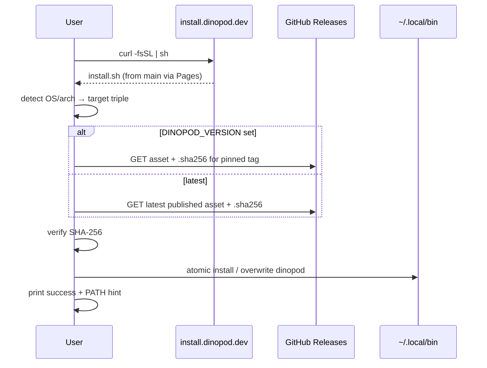

# feat: Add curl install script for dinopod

## Overview

Add a Unix curl-based install path (`curl -fsSL https://install.dinopod.dev | sh`) that downloads prebuilt binaries from existing GitHub Releases, verifies SHA-256 checksums, and installs the `dinopod` binary to a user-writable directory. Reuse the current tag-triggered `.github/workflows/release.yml` without changes to artifact naming or build matrix.

This implements the deferred U9 follow-up from the MVP plan (see origin: `docs/plans/2026-05-28-001-feat-dinopod-secure-mvp-plan.md`).

## Problem Frame

Dinopod already builds and publishes platform archives with checksum sidecars on `v*` tags, but users must manually download from GitHub Releases. The README still describes shell installer support as a follow-up. Operators need a one-command install that matches the existing release contract and security expectations (HTTPS, checksum verification, clear errors).

Prior conversation decisions carried into this plan:

- **No `dev`/`main` branch split** — keep `main` + feature branches + tagged releases
- **Curl install only for now** — Homebrew tap deferred
- **No auto-update in the install script** — upgrades are re-running the installer; `dinopod self-update` deferred to a future iteration
- **Keep `release.yml` as-is** — installer consumes its outputs; do not introduce `cargo-dist` or a second packaging pipeline

## Requirements Trace

- **R1.** Users can install dinopod with `curl -fsSL https://install.dinopod.dev | sh` on supported Unix platforms.
- **R2.** Installer downloads artifacts matching `.github/workflows/release.yml` naming: `dinopod-{tag}-{target}.tar.gz` + `.sha256` sidecar.
- **R3.** Installer verifies SHA-256 before placing the binary on disk.
- **R4.** Installer resolves version from `DINOPOD_VERSION` or the latest **published** GitHub Release (never draft).
- **R5.** Installer supports `DINOPOD_INSTALL_DIR` with a documented default of `~/.local/bin`.
- **R6.** Changes to `scripts/install.sh` are validated in CI (shellcheck + script tests).
- **R7.** Merging to `main` deploys the install script to `install.dinopod.dev`.
- **R8.** README documents the curl install path, supported platforms, env vars, and upgrade via re-run.
- **R16** (origin): Release tooling remains build/distribution-only — no runtime deps added to the Rust binary beyond a `--version` flag for post-install verification.
- **R17** (origin): Shell installer builds on the existing prebuilt-binary + checksum release path.
- **R25** (origin): CI stays strict; new installer checks integrate without weakening existing gates.

## Scope Boundaries

- Unix curl|sh only (Linux glibc x86_64, macOS Intel, macOS Apple Silicon)
- No changes to release build matrix or artifact layout in `release.yml`
- No Homebrew tap, npm wrapper, or Windows curl installer
- No `dinopod self-update` subcommand
- No automatic shell RC / PATH mutation (print hints only)
- No separate marketing website — README remains primary docs

### Deferred to Separate Tasks

- **Homebrew tap**: separate `homebrew-tap` repo when needed
- **`dinopod self-update`**: future CLI feature; upgrade path for v1 is re-run curl installer
- **`dinopod.dev` landing/docs site**: optional GitHub Pages later; not required for install
- **Linux aarch64 release target**: requires extending `release.yml` matrix separately

## Context & Research

### Relevant Code and Patterns

- `.github/workflows/release.yml` — tag-triggered draft → build → upload → publish; artifact contract is authoritative
- `.github/workflows/ci.yml` — PR + `main` push gates; extend or add parallel job for installer validation
- `README.md` — install section defers shell installer; update when script ships
- `docs/plans/2026-05-28-001-feat-dinopod-secure-mvp-plan.md` — U9 defines CI/release/installer readiness (R15–R17, R25)
- `tests/architecture.rs` — policy-style tests; optional pattern for artifact-name contract checks
- `src/cli.rs` — clap CLI; no `--version` flag yet (needed for post-install smoke)

### Institutional Learnings

- No `docs/solutions/` entries yet — this work seeds distribution knowledge
- MVP plan explicitly scoped shell installer as post-first-release follow-up; binary release path is already implemented

### External References

- GitHub Releases download URL pattern: `https://github.com/dinogomez/dinopod/releases/download/{tag}/dinopod-{tag}-{target}.tar.gz`
- Common CLI install patterns: `set -euo pipefail`, temp dir + atomic `mv`, checksum before execute

## Key Technical Decisions

| Decision | Rationale |
|----------|-----------|
| **Script lives at `scripts/install.sh`** | Greenfield in this repo; versioned in git, deployed on merge to `main` |
| **Host via GitHub Pages + custom domain `install.dinopod.dev`** | Zero extra infra for a solo OSS CLI; supports custom domain and HTTPS; script served as static file at domain root or `/install.sh` with redirect |
| **Default install dir `~/.local/bin`** | User-writable, no sudo, XDG-friendly; matches common Rust/Go CLI conventions |
| **Latest version via GitHub Releases redirect** | Prefer `https://github.com/dinogomez/dinopod/releases/latest/download/...` asset URLs where possible to avoid unauthenticated API rate limits; fall back to explicit tag when `DINOPOD_VERSION` is set |
| **Hard-fail unsupported platforms** | v1 targets only the three Unix triples already in `release.yml`; clear error for Windows, Linux arm64, musl/Alpine |
| **Idempotent overwrite** | Re-run replaces binary; fail with actionable message if binary is in use (`Text file busy`) |
| **No `dev` branch or auto-PR workflow** | Script on `main` is the stable installer; binaries always from tagged releases |
| **Keep `release.yml` unchanged** | User confirmed existing workflow is sufficient; reduces scope and risk |

## Open Questions

### Resolved During Planning

- **Branch strategy?** `main` + feature branches only; no `dev`/auto-PR.
- **Auto-update in script?** No — document re-run; defer `self-update` to CLI.
- **Default install directory?** `~/.local/bin`.
- **Musl/Alpine Linux?** Hard fail at detect time with supported-platform list.
- **PATH auto-config?** Print hint only; do not edit `.bashrc`/`.zshrc`.
- **Hosting for `install.dinopod.dev`?** GitHub Pages from this repo (recommended default).

### Deferred to Implementation

- **Exact GitHub Pages config** (`/` vs `/install.sh`, CNAME file location): depends on DNS setup chosen during implementation
- **Bats vs plain shell fixture tests**: pick based on CI runner availability and maintainer preference
- **Draft-release race window**: confirm redirect/latest URL behavior during first live release smoke test

## High-Level Technical Design

> *This illustrates the intended approach and is directional guidance for review, not implementation specification. The implementing agent should treat it as context, not code to reproduce.*



**Release → installer contract** (must stay in sync with `release.yml`):

| Platform | Rust target | Archive |
|----------|-------------|---------|
| Linux x86_64 (glibc) | `x86_64-unknown-linux-gnu` | `.tar.gz` |
| macOS Intel | `x86_64-apple-darwin` | `.tar.gz` |
| macOS Apple Silicon | `aarch64-apple-darwin` | `.tar.gz` |

## Output Structure

```
scripts/
  install.sh
.github/workflows/
  ci.yml                    # extend: shellcheck + script tests
  deploy-installer.yml      # new: deploy script to GitHub Pages on main
docs/
  install-dns.md            # optional: DNS + Pages setup notes for operator
```

## Implementation Units

- [ ] **Unit 1: Expose CLI version for post-install verification**

**Goal:** Allow the install script and users to confirm a successful install with `dinopod --version`.

**Requirements:** R8, R16

**Dependencies:** None

**Files:**
- Modify: `src/cli.rs`
- Test: `tests/cli.rs`

**Approach:**
- Enable clap's built-in version flag on the root `Cli` struct (sourced from `Cargo.toml` / `CARGO_PKG_VERSION`)
- Ensure version prints without requiring a subcommand

**Patterns to follow:**
- Existing clap `Parser` setup in `src/cli.rs`
- Error prefix convention `dinopod:` in `src/main.rs`

**Test scenarios:**
- Happy path: `dinopod --version` exits 0 and prints semver matching `Cargo.toml`
- Edge case: `dinopod --version` works when no subcommand is provided (does not print help instead)

**Verification:**
- `dinopod --version` is usable immediately after install script completes

---

- [ ] **Unit 2: Implement `scripts/install.sh`**

**Goal:** Provide the core Unix installer that downloads, verifies, and installs the release binary.

**Requirements:** R1–R5

**Dependencies:** Unit 1 (for optional post-install smoke)

**Files:**
- Create: `scripts/install.sh`

**Approach:**
- Use `set -euo pipefail` throughout (match `release.yml` bash style)
- Detect OS/arch via `uname`; map to one of three supported Rust triples
- Detect musl-only Linux (e.g. Alpine) and fail early with clear message
- Resolve version: honor `DINOPOD_VERSION` when set; otherwise use latest published release assets
- Download `.tar.gz` and matching `.sha256` sidecar from `github.com/dinogomez/dinopod`
- Parse sidecar format produced by release workflow (`HASH  filename`); verify with `sha256sum` or `shasum`
- Extract to temp directory; `chmod +x`; atomic `mv` into `DINOPOD_INSTALL_DIR` (default `~/.local/bin`, create if missing)
- Warn if running as root; discourage system-wide install without explicit opt-in
- On success: print installed path; if install dir not in `PATH`, print export hint
- On failure: non-zero exit with `dinopod install:` prefixed messages; clean up temp artifacts
- Document in script header: supported platforms, env vars, upgrade = re-run

**Technical design:** *(directional)*

```
INPUT:  DINOPOD_VERSION?, DINOPOD_INSTALL_DIR?
DETECT: os, arch → target triple | FAIL unsupported
FETCH:  tarball + sha256 sidecar for tag
VERIFY: checksum matches tarball bytes
INSTALL: extract → chmod → mv to bindir (overwrite ok)
OUTPUT: success message + PATH hint if needed
```

**Patterns to follow:**
- Artifact naming from `.github/workflows/release.yml`
- User-facing error tone from CLI (`dinopod:` prefix family)

**Test scenarios:**
- Happy path (mocked HTTP): linux/x86_64 → downloads correct artifact name, verifies checksum, installs binary
- Happy path (mocked HTTP): darwin/arm64 → selects `aarch64-apple-darwin` artifact
- Edge case: unsupported OS/arch → exit non-zero with supported list
- Edge case: musl/Alpine detected → exit non-zero before download
- Edge case: `DINOPOD_INSTALL_DIR` set → installs to custom path
- Edge case: `DINOPOD_VERSION=v0.0.0-does-not-exist` → 404 with clear error
- Error path: checksum mismatch → abort, no binary in install dir
- Error path: install dir not writable → fail before or without partial install
- Error path: missing `curl` or `tar` → fail fast with dependency message
- Integration: idempotent second run overwrites existing binary successfully

**Verification:**
- Manual smoke against a published test tag succeeds on at least one macOS and one Linux environment

---

- [ ] **Unit 3: Add installer test harness and CI validation**

**Goal:** Prevent install script regressions in PR CI.

**Requirements:** R6, R25

**Dependencies:** Unit 2

**Files:**
- Create: `tests/install/fixtures/` (mock release responses, sample tarball + sidecar)
- Create: `tests/install/install.bats` (or equivalent shell test runner)
- Modify: `.github/workflows/ci.yml`

**Approach:**
- Add `shellcheck` job (or step) scoped to `scripts/install.sh`
- Run bats tests with mocked `curl`/`uname` via fixtures or wrapper functions injected in test env
- Trigger installer CI when `scripts/install.sh` or install tests change (path filter acceptable)

**Execution note:** Start with fixture-based tests that mock network; avoid depending on live GitHub in PR CI.

**Patterns to follow:**
- Fake command pattern from `tests/cli.rs` (inline `#!/bin/sh` stubs)
- Strict CI gates in `.github/workflows/ci.yml`

**Test scenarios:**
- Happy path: fixture release → install succeeds, binary exists and is executable
- Error path: bad checksum fixture → install aborts
- Error path: unsupported platform stub → exit non-zero
- Integration: CI job fails if `shellcheck` reports issues on `scripts/install.sh`

**Verification:**
- PR touching `scripts/install.sh` runs shellcheck + bats and blocks merge on failure

---

- [ ] **Unit 4: Deploy install script to `install.dinopod.dev`**

**Goal:** Serve the install script at a stable HTTPS URL updated on every merge to `main`.

**Requirements:** R7

**Dependencies:** Unit 2

**Files:**
- Create: `.github/workflows/deploy-installer.yml`
- Create: `docs/install-dns.md` (operator setup: CNAME, GitHub Pages custom domain)
- Optional: root-level `CNAME` or `docs/CNAME` depending on Pages source branch/path

**Approach:**
- GitHub Pages workflow on push to `main` when `scripts/install.sh` (or pages config) changes
- Publish `scripts/install.sh` as the domain root response (or redirect `/` → raw script)
- Set `Content-Type: text/plain; charset=utf-8`
- Use short cache TTL or cache-bust headers so script updates propagate quickly after merge
- Document DNS: `install.dinopod.dev` CNAME → GitHub Pages host

**Test expectation:** none for DNS itself — operator verification documented in `docs/install-dns.md`

**Patterns to follow:**
- Tag-only release in `release.yml` (deploy workflow is independent — script from `main`, binaries from tags)

**Test scenarios:**
- Integration: after deploy, `curl -fsSL https://install.dinopod.dev` returns 200 and matches `scripts/install.sh` content from `main`
- Edge case: script begins with valid shebang; no UTF-8 BOM

**Verification:**
- `install.dinopod.dev` serves the script over HTTPS; operator doc explains one-time DNS setup

---

- [ ] **Unit 5: Update README and capture first-release smoke checklist**

**Goal:** Document the supported install path and give operators a clear end-to-end verification list.

**Requirements:** R8

**Dependencies:** Units 1–4; at least one published `v*` release with assets

**Files:**
- Modify: `README.md`
- Modify: `docs/install-dns.md` (add smoke checklist section)

**Approach:**
- Replace "shell installer follow-up" language with curl one-liner
- Document supported platforms, `DINOPOD_VERSION`, `DINOPOD_INSTALL_DIR`, upgrade via re-run
- Note Windows/manual GitHub Releases path
- Add operator smoke checklist: tag release → wait for publish → curl install → `dinopod --version`

**Patterns to follow:**
- Existing README install section structure

**Test scenarios:**
- Test expectation: none — documentation only

**Verification:**
- README install instructions match script behavior and env var names exactly

## System-Wide Impact

- **Interaction graph:** Install script is standalone shell; consumes GitHub Releases only. No changes to dinopod runtime (`git`, `docker`, config under `~/.config/dinopod`).
- **Error propagation:** Install failures stay in the shell script; dinopod CLI error handling unchanged.
- **State lifecycle risks:** Overwriting binary while `dinopod` is running may fail — script should surface OS error clearly.
- **API surface parity:** N/A — new distribution surface only.
- **Integration coverage:** Full curl→install→`--version` path requires a published release smoke test outside unit fixtures.
- **Unchanged invariants:** `release.yml` artifact matrix, CI quality gates, CLI subcommands, config schema, and runtime dependencies remain as today.

## Risks & Dependencies

| Risk | Mitigation |
|------|------------|
| Draft release race (tag pushed, assets not yet published) | Use latest **published** release URLs only; document retry in smoke checklist |
| MITM or tampered download | Mandatory SHA-256 verification; HTTPS only |
| Compromised `main` deploys bad install script | PR review + CI on script; short cache TTL on Pages |
| Alpine/musl users install glibc binary | Detect musl and fail with explicit message |
| DNS/Pages misconfiguration | Operator doc + smoke test before announcing install URL |
| Artifact naming drift vs `release.yml` | Document contract in plan; optional architecture test in future PR |

## Dependencies / Prerequisites

- GitHub repo admin access to enable Pages and set custom domain
- DNS control for `install.dinopod.dev` (CNAME to GitHub Pages)
- At least one published `v*` release with all three Unix artifacts before public install URL announcement

## Documentation / Operational Notes

- One-time operator setup documented in `docs/install-dns.md`
- After first release: run full smoke (`curl | sh`, then `dinopod --version`)
- Upgrade path for users: re-run the same curl command (idempotent overwrite)

## Sources & References

- **Origin document:** [docs/plans/2026-05-28-001-feat-dinopod-secure-mvp-plan.md](docs/plans/2026-05-28-001-feat-dinopod-secure-mvp-plan.md) (U9, R17)
- Release workflow: `.github/workflows/release.yml`
- CI workflow: `.github/workflows/ci.yml`
- README install section: `README.md`
