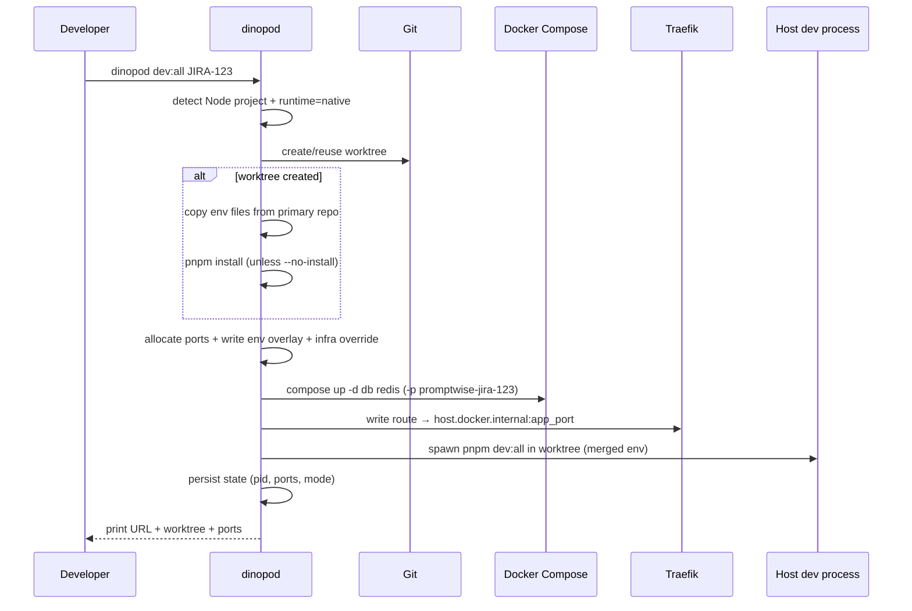

# feat: Native Dev Mode for Node Projects

## Overview

Add a **native dev runtime** to Dinopod so Node.js projects (starting with Next.js) can use per-ticket isolation without containerizing the app. The target UX is:

```text
dinopod dev:all JIRA-123
→ worktree + isolated Compose infra + host dev process + http://jira-123-<repo>.localhost
```

No `dinopod init`, no Dockerfile, and no edits to the project's checked-in Compose or env files. Dinopod owns generated artifacts under `.dinopod/` in each worktree and under the user's Dinopod config directory.

**Prerequisites (zero-config means no repo file edits, not zero host setup):** primary repo has populated `.env.local` (or equivalent), Docker running, and Node/pnpm on PATH. On **new worktrees**, Dinopod runs `pnpm install` / `npm ci` automatically unless `--no-install` is passed. Secrets are not pulled from Infisical — copy env into the primary repo first.

This plan keeps the existing **container runtime** (current MVP) intact and adds a parallel path selected automatically for Node repos.

## Problem Frame

Developers on Node/Next.js stacks commonly run the app on the host (`pnpm dev`, `pnpm dev:all`) and use Docker Compose only for Postgres, Redis, and similar infra. The current Dinopod MVP requires an `app` Compose service and routes Traefik to a container network alias. That forces containerization and config changes — the opposite of Dinopod's stated value: make multi-ticket local dev boring without touching the repo.

Promptwise is the reference shape: `docker-compose.yml` with `db` + `redis`, `package.json` with `"dev:all": "concurrently \"next dev\" \"pnpm trigger:dev\""`, secrets in `.env.local`, app on port 3000.

(see origin: conversation + `docs/plans/2026-05-28-001-feat-dinopod-secure-mvp-plan.md` problem frame)

## Requirements Trace

- **R1.** Node repos at the Git root with a `package.json` can start a ticket environment without `dinopod init`.
- **R2.** `dinopod dev:all <ticket>` runs the named npm/pnpm script in the ticket worktree on the host.
- **R3.** `dinopod dev <ticket>` auto-selects a dev script: prefer `dev:all`, then `dev`, then fail with a clear message.
- **R4.** Dinopod creates or reuses a Git worktree and branch per ticket (existing behavior).
- **R5.** Dinopod starts **infra-only** Compose for the ticket (`docker compose -p <project> up -d <services…>`) with isolated volumes and project name.
- **R6.** Dinopod assigns **deterministic per-ticket host ports** for infra services and the app process so parallel tickets do not collide.
- **R7.** Dinopod copies env files from the primary repo into the worktree once at worktree creation; user-owned env files are never mutated.
- **R8.** Dinopod generates a ticket-specific env overlay (`.dinopod/env.overlay`) that overrides connection URLs and public app URLs for the ticket hostname.
- **R9.** Traefik routes `{ticket}-{repo}.localhost` to the host app via `host.docker.internal:<app_port>`.
- **R10.** `stop`, `down`, and `rm` tear down the host dev process as well as Compose infra (extend existing lifecycle semantics).
- **R11.** `list --reconcile` detects dead host processes and marks environments stale.
- **R12.** Existing container-mode environments continue to work when `runtime = "container"` is set, or when the repo has an app Compose service and **no** root `package.json` (legacy docker-only repos).
- **R13.** Core orchestration remains testable via `LifecyclePorts` fakes without Docker or real Node installs.
- **R14.** `dinopod logs <ticket>` tails the native dev log (`.dinopod/dev.log`) for background processes.
- **R15.** New worktrees auto-install dependencies (`pnpm install` / `npm ci`) unless `--no-install` is passed; failures surface install stderr clearly.

## Scope Boundaries

- Auto-detect **Next.js at repo root** first (port 3000, `-H 0.0.0.0` injection when spawning `next dev` indirectly via npm script).
- Package manager detection from lockfiles in v1: `pnpm-lock.yaml`, `package-lock.json` only (Promptwise reference); yarn/bun deferred.
- Compose infra at repo root only (no monorepo package-root detection in this iteration).
- HTTP on `*.localhost` only (same as MVP).
- Env overlay covers documented keys only in v1 (`DATABASE_URL`, `DIRECT_URL`, `REDIS_URL`, `NEXT_PUBLIC_APP_URL`, `BETTER_AUTH_URL`, `PORT`); config extensibility deferred.

### Deferred to Separate Tasks

- **Monorepo roots** (`apps/web/package.json`): separate iteration once root detection is stable.
- **Frameworks beyond Next.js** (Vite, Remix, Nuxt): detection table extension, not v1 scope.
- **`dev --base <branch>`** — fork ticket worktree from current HEAD instead of `default_branch`; document v1 behavior as main-based.
- **npm wrapper / `npx dinopod`**: deferred in MVP plan.
- **HTTPS / mkcert**: deferred in MVP plan.
- **Env allowlist/denylist** for dangerous prod keys in copied `.env.local`: document risk in v1; hardening follow-up.

### Non-Goals

- Replacing or editing user-owned `docker-compose.yml`, `.env`, or `.env.local`.
- Running Trigger.dev cloud workers — only whatever the user's script starts.
- Secrets manager / Infisical integration — user copies env via existing project workflow before `dinopod dev`.

## Context & Research

### Relevant Code and Patterns

- Lifecycle orchestration: `src/lifecycle.rs`, `LifecyclePorts`, rollback on partial `dev` failure (see `docs/plans/2026-05-28-002-refactor-pr1-review-findings-plan.md`).
- Production adapters: `src/runtime.rs`, `CommandRunner` in `src/cmd.rs`.
- Compose validation/override: `src/compose.rs` — JSON inspection via `docker compose config`, generated override pattern.
- Traefik routes: `src/routes.rs` — today targets Docker network alias; needs mode branch.
- Proxy: `src/proxy.rs` — shared Traefik without Docker socket.
- Naming: `src/names.rs`, `src/domain.rs` — reuse for host/project/worktree.
- State: `src/state.rs` — extend with optional fields + serde defaults for backward compatibility.
- Fake testing: `tests/state.rs` (`FakePorts`), `tests/compose_config.rs`, `tests/proxy_config.rs`.
- E2E pattern: `tests/e2e.rs` (ignored Docker smoke).

### Institutional Learnings

- `docs/solutions/` does not exist yet; architecture source of truth remains `docs/plans/2026-05-28-001-feat-dinopod-secure-mvp-plan.md`.
- Do not mutate user Compose files; layer Dinopod-owned overrides only.
- Always pass user compose + Dinopod override as `-f` pair for lifecycle parity.
- Write Traefik route **before** starting runtime; remove route on `down`/`rm` failure paths.
- Git worktree commands must use `repo_root` as cwd (`docs/plans/2026-05-28-002-refactor-pr1-review-findings-plan.md`).

### External References

- Traefik file provider (no Docker socket): `docs/plans/2026-05-28-001-feat-dinopod-secure-mvp-plan.md`
- Docker Compose project isolation via `-p`: MVP plan references
- `host.docker.internal` on Linux requires `extra_hosts: host-gateway` on Traefik container (Docker docs)

## Key Technical Decisions

| Decision | Rationale |
|----------|-----------|
| **Two runtime modes: `native` and `container`** | Preserves MVP for fully dockerized apps; Node repos use native without breaking existing configs. |
| **Auto-select `native` when** root `package.json` exists **and** resolved Compose JSON has **no** service matching configured/default app name (`app`) | Promptwise-shaped repos need no config. |
| **Auto-select `container` when** an app service exists and there is **no** root `package.json` | Legacy docker-only repos keep MVP behavior without config. |
| **Fail with guidance when** root `package.json` **and** app service both exist without `runtime` in config | Avoids silent wrong-mode selection; user sets optional `runtime = "native"` or `"container"`. |
| **CLI: dedicated `dev:all` subcommand** (`DevAll { ticket }`) delegating to `dev --script dev:all` | Clap aliases do not populate `--script`; explicit subcommand matches advertised UX. |
| **Infra services = all Compose services except the configured app service name when present; otherwise all services** | Promptwise: `db`, `redis`. Repos with unused `app` service: exclude only that name. |
| **Deterministic ports from `(repo_slug, ticket_slug)` hash** | Hash picks starting offsets in ranges: app `31000–31999`, postgres `54000–54999`, redis `63000–63999`. Linear probe on bind collision at first allocation; **persist `PortPlan` in state** and reuse on re-dev (probe result is stable per ticket, not recomputed each run). |
| **Compose override publishes infra ports + removes fixed-port collisions** | Dinopod-owned override replaces host bindings for infra services per ticket (same layering model as proxy-network override today). |
| **Env overlay at `.dinopod/env.overlay`, regenerated every `dev`** | User env files copied once on worktree create; overlay holds ticket-specific URLs/ports. **Spawn injects merged env via `CommandSpec.env`** (parse copied files + overlay into map; overlay wins). Always set `PORT` and `HOSTNAME=0.0.0.0` for native Next.js (npm scripts cannot receive CLI `-H`). |
| **Background dev process with PID file** | Matches `compose up -d` ergonomics; enables `stop`/`down`/`rm`. Logs to `.dinopod/dev.log`. |
| **Re-run while running: stop existing PID, then respawn** | Idempotent `dev` consistent with container `compose up` repair behavior. |
| **Traefik upstream `http://host.docker.internal:{app_port}` in native mode** | Host process not on Docker network. Add `extra_hosts` to proxy compose on Linux. |
| **Reconcile checks PID liveness + infra compose ps** | Fixes stale `Running` when user kills dev server manually. |
| **Next.js spawn guard: `PORT` + `HOSTNAME=0.0.0.0`** | Traefik via `host.docker.internal` cannot reach `127.0.0.1`-only listeners; document `allowedDevOrigins` for HMR (user docs, not Dinopod mutation). |
| **`.dinopod/` artifacts use restrictive permissions** | Create `.dinopod/` as `0700`; write overlay, `dev.log`, `dev.pid`, and copied env files as `0600`. Do not follow symlinks when copying env files. |
| **Inspect merged compose config for stray host ports** | After layering user `docker-compose.override.yml`, validate merged JSON; block or warn when infra services retain fixed host bindings outside `PortPlan`. |
| **Native dev rollback** | On spawn failure after infra up: `compose_down` + `remove_route` before error (extend container rollback pattern). |
| **Proxy repair includes `extra_hosts`** | Extend `classify_proxy_container` / `ProxyRuntimeSpec` so Linux Traefik gets `host.docker.internal:host-gateway` and unhealthy proxies are repaired. |
| **HTTP readiness gate before success output** | Short poll to `app_host_port` before printing URL and setting `Running`; on timeout, rollback and surface `dev.log` tail. |
| **Auto-install on new worktree** | After env copy on `WorktreeAction::Created`, run detected package manager install in worktree unless `--no-install`. Skip if `node_modules` already present. |
| **`dev --refresh-env`** | Re-merge **missing keys only** from primary repo env files into worktree copies (never overwrite keys the developer edited in the worktree). |
| **Hard-fail stray infra host ports** | After merged compose inspection, error if any infra service still publishes a fixed host port outside `PortPlan` (blocks Promptwise `docker-compose.override.yml` collisions). |
| **Provisional state on dev start** | Write state record with `status=starting` before compose up; rollback route/compose on interrupt or failure before `Running`. |
| **Reconcile verifies process identity** | PID liveness plus cmdline/worktree-path match (not PID alone) before keeping `Running`. |

## Open Questions

### Resolved During Planning

| Question | Resolution |
|----------|------------|
| CLI shape | `dev:all` alias + optional `--script` on `dev`. |
| `.env` overwrite on re-dev | Copy env files only on worktree **create**; overlay regenerated each dev. |
| `stop` vs route | Keep route on `stop` (parity with container mode); traffic may 502 until `dev` respawns — document in README troubleshooting. |
| Native + container same ticket | Same project name derivation — **one mode per ticket**; if mode mismatch on re-dev, fail with message to `dinopod rm` first. |
| Default script for `dinopod dev` | `dev:all` if script exists, else `dev`. |
| Install on new worktree | Auto-run package manager install on `Created`; `--no-install` to skip. |
| Stale primary env files | `--refresh-env` merges missing keys from primary; never overwrites worktree edits. |
| Stray infra host ports | Hard-fail after merged compose inspect (not warn-only). |
| Module layout | `ports` logic lives in `env.rs` (not a separate crate module) until a second consumer appears. |
| `dinopod logs` | Ship in Unit 5 — required for background native dev UX. |

### Deferred to Implementation

| Question | Why deferred |
|----------|--------------|
| Exact env keys to rewrite beyond Postgres/Redis/app URL | Inspect real Promptwise `.env.example` during overlay implementation; start with documented set. |
| Optimal readiness poll timeout | Start with 60s cap, 500ms interval; tune from e2e. |

## High-Level Technical Design

> *This illustrates the intended approach and is directional guidance for review, not implementation specification. The implementing agent should treat it as context, not code to reproduce.*



**Mode selection matrix**

| Condition | Runtime |
|-----------|---------|
| `dinopod.toml` has `runtime = "container"` | container |
| `dinopod.toml` has `runtime = "native"` | native |
| No config; root `package.json`; no `app` service in resolved compose | native |
| No config; `app` service in compose; no root `package.json` | container |
| No config; root `package.json` **and** `app` service in compose | **error** — print guidance to set `runtime = "native"` or `"container"` in optional `dinopod.toml` |

## Output Structure

```text
src/
  detect.rs          # package.json / Next.js / package manager / mode detection
  env.rs             # env copy, overlay, port plan allocation
  process.rs         # host dev spawn/stop/PID/log
  routes.rs          # (modify) mode-aware upstream
  compose.rs         # (modify) infra override + filtered compose up
  config.rs          # (modify) runtime mode + optional overrides
  lifecycle.rs       # (modify) native dev orchestration branch
  runtime.rs         # (modify) adapter implementations
  state.rs           # (modify) extended EnvironmentRecord
  cli.rs             # (modify) dev flags, dev:all, logs
tests/
  detect.rs
  env.rs             # includes port allocation tests
  process.rs
  native_lifecycle.rs
  fixtures/
    next-package/package.json
    infra-compose/docker-compose.yml
```

## Implementation Units

- [ ] **Unit 1: Project detection and runtime mode resolution**

**Goal:** Identify Node projects and choose `native` vs `container` without requiring `dinopod init`.

**Requirements:** R1, R2, R3, R12

**Dependencies:** None

**Files:**
- Create: `src/detect.rs`
- Modify: `src/config.rs`, `src/lib.rs`, `src/app.rs`
- Test: `tests/detect.rs`
- Fixture: `tests/fixtures/next-package/package.json`, `tests/fixtures/infra-compose/docker-compose.yml`

**Approach:**
- Parse `package.json` for `dependencies`/`devDependencies` containing `next`.
- Detect package manager from lockfile presence (`pnpm-lock.yaml`, `package-lock.json`).
- Resolve dev script name from CLI (`--script`) or defaults (`dev:all` → `dev`).
- Resolve runtime mode using the mode selection matrix; optional `dinopod.toml` fields: `runtime`, `[native] dev_script`, `[native] app_port`.
- Expose a `ProjectProfile` struct consumed by lifecycle (package manager, script, **default_app_port**, runtime) — no multi-framework table in v1.
- Change `LifecyclePorts::ensure_worktree` to return `WorktreeAction` (`Created` | `Reused`) so env copy runs only on create.

**Patterns to follow:**
- Typed domain values in `src/domain.rs`
- Config merge precedence in `src/config.rs` (CLI > file > defaults)

**Test scenarios:**
- Happy path: Next.js `package.json` + infra-only compose → `runtime = native`, script `dev:all`, **default_app_port = 3000** (framework default, not allocated ticket port)
- Happy path: explicit `runtime = "container"` in config → container even with `package.json`
- Edge case: missing `dev:all` and `dev` scripts → error names available scripts
- Edge case: no `package.json` and no config → error suggests `dinopod init` or container setup
- Error path: invalid JSON in `package.json` → actionable parse error

**Verification:**
- Unit tests cover detection and mode matrix without Docker

---

- [ ] **Unit 2: Env copy, port plan, and overlay generation**

**Goal:** Copy user env files into worktree once; allocate stable per-ticket ports; generate ticket-specific overlay each dev.

**Requirements:** R6, R7, R8, R15

**Dependencies:** Unit 1

**Files:**
- Create: `src/env.rs`
- Modify: `src/errors.rs`, `src/lib.rs`, `src/lifecycle.rs` (wire later)
- Test: `tests/env.rs`
- Fixture: extend `tests/fixtures/infra-compose/docker-compose.yml`

**Approach:**
- On worktree **create**, copy `.env`, `.env.local`, `.env.development`, `.env.development.local` from primary repo root (skip missing; **copy file contents only, do not follow symlinks**; mode `0600`).
- After env copy on `Created`, run package manager install in worktree unless `--no-install` (skip if `node_modules` exists).
- **`dev --refresh-env`:** merge keys present in primary env files but absent from worktree copies; never overwrite existing worktree keys.
- Never mutate copied user env files after create (except `--refresh-env` additive merge).
- **Port plan** (private to `env.rs`): hash `(repo_slug, ticket_slug)` to seed offsets in app `31000–31999`, postgres `54000–54999`, redis `63000–63999`; linear probe on bind collision at first allocation; persist in state on first successful `dev`.
- Map infra ports by **service name** (`db`/`postgres`, `redis`).
- Generate `.dinopod/env.overlay` with ticket hostname URL and port-mapped DSNs (mode `0600`).
- **Spawn:** parse copied env files + overlay into map; pass all entries through `CommandSpec.env` (overlay wins).

**Execution note:** Implement overlay + port plan test-first — key correctness surface for Promptwise.

**Test scenarios:**
- Happy path: copy creates worktree env files from primary
- Happy path: overlay sets `DATABASE_URL` to `localhost:{postgres_port}` and `NEXT_PUBLIC_APP_URL` to ticket URL
- Happy path: same ticket → same ports; different tickets → different ports
- Happy path: install runs on `Created` when `node_modules` absent; skipped with `--no-install`
- Edge case: worktree re-dev does not overwrite modified worktree `.env.local`
- Edge case: `--refresh-env` adds new primary keys without clobbering worktree edits
- Edge case: primary hash port occupied → probe finds next free port
- Error path: range exhausted → clear error

**Verification:**
- File contents and port plan asserted in temp dirs; fake bind checker for collision probe

---

- [ ] **Unit 3: Infra-only Compose override and filtered up**

**Goal:** Start only infra services with per-ticket published ports; do not require app service.

**Requirements:** R5, R6, R12

**Dependencies:** Unit 1, Unit 2

**Files:**
- Modify: `src/compose.rs`, `src/runtime.rs`, `src/lifecycle.rs`
- Test: `tests/compose_config.rs`, `tests/fixtures/infra-compose/docker-compose.yml`

**Approach:**
- Extend `inspect_compose_config` with mode parameter: native mode does **not** require app service.
- New `render_infra_override(compose_config_json, port_plan, services…)` publishes deterministic host ports from inspected JSON (not hard-coded `5432:5432` literals).
- Validate **merged** compose config (including user `docker-compose.override.yml`); **hard-fail** when infra services retain fixed host bindings outside `PortPlan` after Dinopod override is applied.
- `compose_up_infra(project, files, service_names)` runs `docker compose up -d` with explicit service list.
- Container mode keeps existing `render_override` + full project up unchanged.

**Test scenarios:**
- Happy path: infra-only fixture validates without app service in native mode
- Happy path: generated override replaces `5432:5432` with ticket-specific host port
- Edge case: compose with only db — up succeeds with one service
- Error path: empty compose / no services → error
- Error path: merged config still publishes conflicting host port (e.g. user override `5433:5432`) → hard fail with override guidance

**Verification:**
- JSON inspection tests + fake runner asserts compose command service list

---

- [ ] **Unit 4: Host dev process supervisor**

**Goal:** Spawn, track, stop, and restart the dev script in the worktree.

**Requirements:** R2, R3, R10, R13

**Dependencies:** Unit 1, Unit 2

**Files:**
- Create: `src/process.rs`
- Modify: `src/cmd.rs`, `src/runtime.rs`, `src/errors.rs`
- Test: `tests/process.rs`

**Approach:**
- Extend command boundary with **spawn/detach** on `CommandRunner` or `LifecyclePorts` (Unix: setsid + log file stdio; Windows: detached process group).
- Write `.dinopod/dev.pid` and `.dinopod/dev.log` (both mode `0600`).
- Spawn env must include `PORT`, `HOSTNAME=0.0.0.0`, and overlay-derived vars.
- Stop: SIGTERM with timeout, then SIGKILL; idempotent if not running.
- Re-dev: if PID alive, stop then respawn.
- Preflight: optional `node`/`pnpm`/`npm` on PATH when native mode selected.

**Test scenarios:**
- Happy path: spawn records PID file
- Happy path: stop removes running process (fake signal runner)
- Edge case: stop when already dead — success
- Edge case: spawn failure after compose up — surfaced to lifecycle rollback
- Error path: dev script exits immediately — non-zero exit captured in log path

**Verification:**
- Fakes only in unit tests; no real long-running processes in CI

---

- [ ] **Unit 5: Native routing, state, lifecycle, and logs**

**Goal:** Wire native dev into `LifecycleManager::dev/stop/down/rm/list --reconcile` and Traefik.

**Requirements:** R4, R9, R10, R11, R13, R14

**Dependencies:** Units 1–4

**Files:**
- Modify: `src/routes.rs`, `src/proxy.rs`, `src/lifecycle.rs`, `src/state.rs`, `src/runtime.rs`, `src/cli.rs`, `src/main.rs`, `src/ui.rs`
- Test: `tests/native_lifecycle.rs`, `tests/state.rs`, `tests/proxy_config.rs`, `tests/cli.rs`

**Approach:**
- Extend `EnvironmentRecord` with optional `runtime_mode`, `dev_script`, `app_host_port`, `host_pid`, `env_overlay_path`, `infra_ports`, `port_plan` (serde defaults for backward compat).
- Extend `LifecyclePorts` with native hooks: `copy_env_on_create`, `install_dependencies`, `refresh_env`, `compose_up_infra`, `spawn_dev_process`, `stop_dev_process`, `inspect_compose_for_mode` (update `FakePorts` in same unit).
- Write provisional state (`status=starting`) before compose up; rollback route/compose on failure or interrupt before `Running`.
- `render_route` accepts upstream target enum: `ContainerAlias { alias, port }` | `HostGateway { port }`.
- Linux proxy compose: add `extra_hosts: ["host.docker.internal:host-gateway"]`; extend proxy health check to require it.
- `dev` native sequence: resolve profile/mode → worktree → env copy + install (if `Created`) → optional `--refresh-env` → port plan (reuse from state if present) → infra override → infra up → route write → spawn → **readiness poll** → state persist → print summary.
- Preserve rollback: on infra up or spawn failure after route write, `compose_down` + `remove_route`.
- `stop/down/rm`: kill host process + existing compose lifecycle.
- Reconcile: verify PID alive **and** process cmdline/worktree match; compose ps for infra; mark stale on mismatch.

**CLI changes:**
- `Dev { ticket, script: Option<String>, refresh_env: bool, no_install: bool }`
- Dedicated subcommand `DevAll { ticket }` with clap `name = "dev:all"`
- New `Logs { ticket, follow: bool }` — tail `.dinopod/dev.log` (last 200 lines default; `-f` follow)
- Success output includes URL, worktree, project, app port, infra ports

**Test scenarios:**
- Happy path: native `dev` fake port call order matches designed sequence
- Happy path: route file contains `host.docker.internal` and app port
- Happy path: `stop` invokes process stop + compose stop
- Happy path: reconcile marks dead or mismatched PID as stale
- Happy path: `logs` prints tail of dev log for native environment
- Error path: mode mismatch on re-dev → error instructs `dinopod rm`
- Integration scenario: container-mode existing tests in `tests/state.rs` remain passing unchanged

**Verification:**
- All existing lifecycle tests pass; new native tests cover orchestration order

---

- [ ] **Unit 6: E2E smoke, README, and Promptwise validation notes**

**Goal:** Document the workflow and add optional Docker+Node smoke coverage.

**Requirements:** R1–R15 (integration proof where applicable); **R12** via unchanged container tests in Units 3/5

**Dependencies:** Unit 5

**Files:**
- Modify: `tests/e2e.rs`, `README.md`
- Create: `tests/fixtures/native-smoke/` (minimal Node HTTP server script + infra compose)

**Approach:**
- Ignored e2e: two native tickets, curl hostnames via Traefik, idempotent re-run, stop/down cleanup.
- README section: "Node / Next.js (native dev)" with prerequisites, `dev`/`dev:all`/`logs`/`--refresh-env`/`--no-install`, env overlay behavior, Trigger.dev note, worktree branch behavior, troubleshooting.
- Manual validation checklist for Promptwise-shaped repos (not automated in CI).

**Test scenarios:**
- E2E happy path: two tickets isolated (distinct infra ports + hostnames)
- E2E idempotent re-run: same ticket twice
- E2E lifecycle: stop/down/rm cleanup
- Test expectation: none for README prose — review only

**Verification:**
- `cargo test --test e2e -- --ignored` passes on developer machine with Docker + Node

## System-Wide Impact

- **Interaction graph:** `dev` path branches in `lifecycle.rs`; `list/stop/down/rm/reconcile/logs` must be mode-aware. Proxy compose may change for Linux. CLI surface gains `--script`, `dev:all`, `--refresh-env`, `--no-install`, and `logs`.
- **Error propagation:** Partial native `dev` failures must rollback route (existing pattern) and avoid leaving orphan infra without state — align with PR #1 compensating rollback.
- **State lifecycle risks:** PID orphans if Dinopod crashes post-spawn; provisional `starting` state + reconcile + manual `dinopod rm` mitigation. Old state records without new fields deserialize as container mode.
- **API surface parity:** Container environments unchanged; native adds optional fields only.
- **Integration coverage:** Unit tests prove orchestration order; ignored e2e proves Traefik→host→app path.
- **Unchanged invariants:** User-owned compose and env files; Traefik without Docker socket; atomic route/state writes; Git worktree cwd rules.

## Risks & Dependencies

| Risk | Mitigation |
|------|------------|
| `host.docker.internal` unavailable on Linux | `extra_hosts` on Traefik; e2e on Linux matrix when CI allows |
| Next.js ignores `PORT` for `next dev` | Document; inject `-p` via script wrapper only if detection shows direct `next dev` — prefer env `PORT` first |
| Infra fixed ports in user compose collide | Override replaces bindings; warn on unreplaceable `container_name` collisions |
| Trigger.dev / multi-process scripts | Run script as-is; user responsibility; document resource usage |
| Worktree without `node_modules` | Auto-install on new worktree; `--no-install` to skip |
| User `docker-compose.override.yml` fixed ports | Hard-fail after merged inspect with actionable error |
| Copied `.env.local` contains prod secrets | Document in README; overlay only rewrites DSN/URL keys |
| Mode ambiguity (app service + native intent) | Optional `runtime` in config; fail with guidance when ambiguous |

## Documentation / Operational Notes

- README: native vs container modes, prerequisites checklist, CLI flags, env overlay keys, parallel ticket example, troubleshooting stale state and 502-on-stop behavior.
- Security notes: copied env and `dev.log` may contain secrets; restrictive permissions; N tickets means N secret copies; overlay does not sandbox non-DSN keys from copied `.env.local`.
- Promptwise validation: `dinopod dev:all PRO-944-…` with env files in primary repo (Infisical pull first); verify Trigger.dev sidecar separately.
- Worktree branches fork from `default_branch` (typically `main`), not current HEAD — use existing branch name if ticket branch already exists.

## Sources & References

- **Origin:** User conversation (Promptwise / native dev UX)
- **Prior plan:** `docs/plans/2026-05-28-001-feat-dinopod-secure-mvp-plan.md`
- **Review hardening:** `docs/plans/2026-05-28-002-refactor-pr1-review-findings-plan.md`
- Related code: `src/lifecycle.rs`, `src/compose.rs`, `src/routes.rs`, `src/state.rs`
- Deferred MVP items: Portless/npm wrapper in MVP plan scope boundaries
