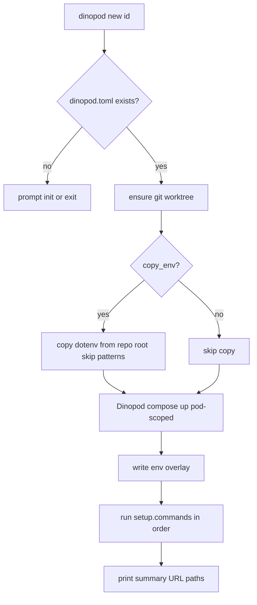

# feat: Pod setup (`dinopod new`), init wizard, and id-first commands

## Overview

Redefine Dinopod v1 around **pods**: a **git worktree** plus **isolated Docker Compose** per id, without port/project collisions across pods. Configuration comes from an interactive **`dinopod init`** (or **`dinopod init -y`**). Pod provisioning is **`dinopod new <id>`**. Everything else is **`dinopod <id> <command> …`** — no auto `pnpm dev`, no `runtime` native/container split.

This supersedes the verb-first CLI (`dinopod dev <id>`), auto dev-script spawning, and container runtime as a user-facing product path. It narrows the native-dev plan (`docs/plans/2026-05-28-004-feat-native-dev-node-plan.md`) to the parts that still apply (env overlay, per-ticket compose overrides, Traefik) while dropping Node-only requirements and automatic app startup.

Preserves MVP invariants from `docs/plans/2026-05-28-001-feat-dinopod-secure-mvp-plan.md`: do not mutate user-owned Compose or env files; Dinopod artifacts live under `.dinopod/`; git/compose are source of truth for runtime state.

## Problem Frame

Today Dinopod assumes a **Node-native dev** path: detect `package.json`, auto-install, auto-run `pnpm dev` / `dev:all`, and start **infra-only** Compose. The CLI is verb-first (`dinopod dev JIRA-123`). There is no project config for setup commands, env copy policy, or an init wizard. Subprocess output is mostly unprefixed; only Dinopod status lines use `[id]` via `EnvironmentUi`.

Teams want:

1. **Worktree isolation** for any repo (Node or not).
2. **Compose isolation** per pod so parallel tickets do not fight over ports or project names.
3. **Explicit commands** — `dinopod number-1 pnpm dev:all`, not magic dev spawning.
4. **`dinopod new number-1`** for one-shot pod setup (worktree + compose + configured setup commands).
5. **`dinopod init`** wizard (or `-y`) producing a readable `dinopod.toml`.
6. **Primary repo env untouched** — copy policy + `.dinopod/env.overlay` for per-pod URLs/ports.
7. **`[id]` prefix on every terminal line** Dinopod and child processes emit for pod-scoped work.

## Requirements Trace

- **R1.** `dinopod init` runs an interactive wizard (TTY) and writes `dinopod.toml`.
- **R2.** `dinopod init -y` writes the same schema using documented defaults (no prompts).
- **R3.** `dinopod.toml` uses `[setup].commands = [ "...", ... ]` (not repeated `[[setup]]` tables).
- **R4.** `[settings].copy_env` (default `true`) gates dotenv copy on **new** worktree; `[settings].env_skip_patterns` skips filenames containing any pattern (default `.production`, `.staging`, `.test`).
- **R5.** `[compose].file` points at the user Compose file (default `docker-compose.yml`). **`[git].default_branch`** and **`[worktree].root`** configure worktree creation.
- **R6.** `dinopod new <id>` creates/reuses worktree, applies env copy policy, runs **Dinopod-managed compose up** (pod project name + `.dinopod/compose.override.yml` ports), then runs `[setup].commands` in order. Fails fast on first failing command.
- **R7.** Setup commands must **not** include `docker compose` / `docker-compose` — validated at config load or `new` time with a clear error (compose is only started by `dinopod new`).
- **R8.** `dinopod new` with no `dinopod.toml`: warn and prompt to run init (reuse `prompt_yes_no`); non-interactive exits with actionable message.
- **R9.** `dinopod <id> <command> [args…]` runs in the pod worktree with merged env (dotenv + overlay); forwards exit code; requires pod to exist (worktree + state) — exact “create on first command” behavior deferred (v1: require `new` first).
- **R10.** Built-in lifecycle under id: `stop`, `down`, `rm`, `logs` (no `dev` / `dev:all` builtins). Global: `init`, `list`, `new`.
- **R11.** All pod-scoped stdout/stderr lines prefixed with `[<id>]` (Dinopod messages and child process output); global commands (`init`, `list`, `new` status before id is known) unprefixed or use a neutral tag.
- **R12.** Env copy/sync source is **git repo root**, not shell cwd.
- **R13.** No auto `pnpm install`, no auto dev script, no `runtime` / container mode in v1 config or wizard.
- **R14.** Verb-first CLI (`dinopod dev <id>`, etc.) may remain one release as hidden/deprecated aliases with stderr warning.
- **R15.** Core logic testable via `LifecyclePorts` / `CommandRunner` / `BufferedUi` fakes.
- **R16.** README and `--help` document the new command model and example `dinopod.toml`.

## Scope Boundaries

- **One compose file** per repo root in v1 (`[compose].file`).
- Compose up starts **all services** in that file (with Dinopod override for host port isolation). Infra-only filtering is removed for the pod model unless a service blocklist is added later.
- Setup commands are shell strings in worktree cwd; merged overlay env injected for the subprocess.
- Traefik/proxy defaults remain in generated config; routing targets the configured primary HTTP service when applicable (implementation may keep `[app].service` internally for backward compat — see Unit 1).

### Deferred to Separate Tasks

- `dinopod <id> …` creating worktree on first use without `new`
- `--run-setup` on reused worktrees
- Per-service compose allowlist in config
- `init --force` overwrite
- Host-app Traefik routing (`host.docker.internal`) for manually started apps
- Container runtime as a supported product mode
- HTTP readiness polling before marking pod ready

### Non-Goals

- User-typed `docker compose up` in setup (forbidden, not wrapped)
- Auto `pnpm dev` / `dev:all` Dinopod subcommands
- `runtime = native | container` in wizard or docs
- Editing user-owned `docker-compose.yml` or committed `.env` files
- Infisical / secrets manager integration

## CLI Surface (v1)

```text
dinopod init [-y]
dinopod new <id>
dinopod list [--reconcile]

dinopod <id> stop
dinopod <id> down [--volumes]
dinopod <id> rm [-y]
dinopod <id> logs [-f]

dinopod <id> <command> [args...]    # passthrough: pnpm, make, cargo, etc.
# Examples:
#   dinopod number-1 pnpm db:migrate
#   dinopod number-1 pnpm dev:all
#   dinopod number-1 make test
```

**Reserved top-level verbs:** `init`, `new`, `list` — cannot be pod ids at the top level.

**Deprecated (optional one release):** `dinopod dev <id>` → suggest `dinopod new <id>` then `dinopod <id> …`; `dinopod exec <id> -- cmd` → `dinopod <id> cmd`.

## Init wizard (`dinopod init`)

| # | Prompt | Default |
|---|--------|---------|
| 1 | Compose file path? | `docker-compose.yml` |
| 2 | Copy env files into new worktrees? `[Y/n]` | yes |
| 3 | Skip env files matching (comma-separated substrings)? | `.production`, `.staging`, `.test` |
| 4 | Worktree root directory? | `../.dinopod-worktrees` |
| 5 | Default branch for new ticket branches? | `main` |
| 6 | Add setup commands now? `[Y/n]` | yes |
| 7 | Setup command (empty to finish) | — |
| 8 | Another command? `[y/N]` | loop |
| 9 | Write `dinopod.toml`? `[Y/n]` | yes |

**Wizard copy must state:** Compose is started by `dinopod new <id>`, not via setup commands. Do not enter `docker compose up`.

**Non-TTY:** behave like `init -y` or print “re-run with -y” (pick one in implementation; prefer auto `-y` when stdin is not a terminal).

## Example `dinopod.toml`

```toml
# Generated by dinopod init
# Pod setup:  dinopod new <id>
# Commands:    dinopod <id> pnpm dev:all

[compose]
file = "docker-compose.yml"

[settings]
copy_env = true
env_skip_patterns = [".production", ".staging", ".test"]

[worktree]
root = "../.dinopod-worktrees"

[git]
default_branch = "main"

[setup]
commands = [
  "pnpm db:migrate",
  "pnpm db:seed",
]

[proxy]
host_suffix = "localhost"
network = "dinopod-proxy"
container_name = "dinopod-traefik"
http_port = 80
image = "traefik:v3.6"
```

`dinopod init -y` writes the same structure with empty `commands = []` or commented example.

## Config schema (implementation mapping)

| TOML | Rust (directional) | Notes |
|------|-------------------|--------|
| `[compose].file` | `ComposeConfig { file }` | Migrate from `[app].compose_file` with merge fallback |
| `[git].default_branch` | `GitConfig` | Migrate from `[app].default_branch` |
| `[worktree].root` | unchanged | |
| `[settings].copy_env` | `bool`, default true | |
| `[settings].env_skip_patterns` | `Vec<String>` | substring match on filename |
| `[setup].commands` | `Vec<String>` | max length cap (e.g. 32) |
| `[proxy].*` | unchanged | |
| `[app].service` | keep optional | Traefik target / inspect only if still needed |

Remove from user-facing config: `runtime`, `[native].dev_script`, starter comments referencing auto dev.

## `dinopod new <id>` flow



**Compose step (built-in, not in `[setup]`):**

- Project: `-p <repo-slug>-<ticket-slug>`
- Files: user `[compose].file` + `.dinopod/compose.override.yml` (generated port plan)
- Env: inject `COMPOSE_FILE`, `COMPOSE_PROJECT_NAME`, and overlay vars for subprocesses
- Does not edit the user's compose file

**Reuse:** existing worktree → skip env copy (same as today); setup commands run only on `WorktreeAction::Created` in v1.

## `dinopod <id> <command>` flow

- Resolve pod state / worktree path (error if `new` never run).
- Regenerate or load env overlay if missing/stale (implementation detail; must have correct DB URLs for that pod).
- Run command in worktree with merged env.
- Stream stdout/stderr through line prefixer: `[id] ` per line.
- Forward child exit code.

No special case for `pnpm` beyond env and cwd.

## Context & Research

### Relevant Code and Patterns

- CLI: `src/cli.rs`, `src/main.rs`
- Config: `src/config.rs`, `render_starter_config`
- Lifecycle: `src/lifecycle.rs` — replace `dev_with_options` entry with `new_pod` (directional name)
- UI: `src/ui.rs` (`EnvironmentUi`, `prompt_yes_no`, `lifecycle_progress`)
- Env: `src/env.rs`, overlay in `.dinopod/env.overlay`
- Compose: `src/compose.rs`, `render_infra_override` → generalize to all published services / full stack
- Process/cmd: `src/cmd.rs`, `src/process.rs` — remove or gate auto dev spawn paths
- Detect: `src/detect.rs` — demote to optional helpers only, not required for `new`
- Tests: `tests/cli.rs`, `tests/config.rs`, `tests/state.rs`, `tests/env.rs`

### Institutional Learnings

- Typed TOML sections, not `ConfigOverrides` (`docs/plans/2026-05-28-002-refactor-pr1-review-findings-plan.md`)
- Git cwd = `repo_root` (`docs/plans/2026-05-28-002-refactor-pr1-review-findings-plan.md`)
- Env: no symlink copy; overlay for ticket URLs (`docs/plans/2026-05-28-004-feat-native-dev-node-plan.md`)

### External References

- None required.

## Key Technical Decisions

- **Pod = worktree + isolated compose** — not “native Node Dinopod.” Node projects are supported; non-Node projects are first-class.
- **`dinopod new` owns compose** — setup commands are for app-level steps after compose is up.
- **Reject `docker compose` in `[setup].commands`** — prevents double-up and port collisions.
- **`[setup].commands` array** — readable TOML, stable order.
- **No auto app start** — `pnpm dev:all` is `dinopod <id> pnpm dev:all`.
- **Line-buffered `[id]` prefix** on child I/O — new small helper used by setup runner, compose logs (if shown), and id command runner.
- **Backward compat:** parse legacy `[app]` keys into new struct fields; deprecate in template only.

## Open Questions

### Resolved During Planning

- Setup TOML shape → `[setup].commands = [ ... ]`
- Who runs compose? → `dinopod new` only
- Runtime modes? → dropped for v1
- Auto pnpm dev? → dropped; explicit `dinopod <id> …`
- Setup command name → `new`, not `dev`

### Deferred to Implementation

- Exact clap structure for passthrough args after id (likely `dinopod <id> <rest>..` with external subcommand or custom parser)
- Whether `logs` tails `.dinopod/dev.log` or compose logs when no dev supervisor exists
- Traefik registration on `new` for non-HTTP compose-only pods

## Implementation Units

- [ ] **Unit 1: Config schema, validation, and init output**

**Goal:** Parse new TOML sections; wizard/`init -y` emit documented template.

**Requirements:** R1–R5, R7, R16

**Dependencies:** None

**Files:**
- Modify: `src/config.rs`
- Modify: `src/main.rs` (`init`, wizard in new module e.g. `src/init_wizard.rs` directional)
- Test: `tests/config.rs`

**Approach:**
- Add `SettingsConfig`, `SetupConfig { commands }`, `ComposeConfig`, `GitConfig`; merge partials with `deny_unknown_fields`.
- Validate setup commands: reject if command matches docker compose pattern (case-insensitive).
- `render_starter_config` / wizard output matches example in this plan.
- Legacy: if `[compose]` absent, read `[app].compose_file` and `[app].default_branch`.

**Test scenarios:**
- Happy path: parse `[setup].commands` array preserves order.
- Error path: `commands` containing `docker compose up -d` fails validation.
- Happy path: `env_skip_patterns` applied in copy helper (Unit 2).
- Happy path: `init -y` output parses via `from_toml_str`.

**Verification:** `tests/config.rs` green.

---

- [ ] **Unit 2: Interactive init wizard and `init -y`**

**Goal:** Implement wizard prompts table; `-y` writes defaults.

**Requirements:** R1, R2, R16

**Dependencies:** Unit 1

**Files:**
- Create: `src/init_wizard.rs` (directional)
- Modify: `src/cli.rs` (`Init { yes: bool }` flag)
- Modify: `src/main.rs`
- Test: `tests/cli.rs`

**Test scenarios:**
- Happy path: `init -y` creates `dinopod.toml` with `[setup].commands = []`.
- Edge case: existing config → `ConfigAlreadyExists`.
- Happy path: wizard with scripted stdin (optional) writes migrate/seed into commands array.

**Verification:** CLI integration test for `init -y`.

---

- [ ] **Unit 3: Env copy policy and repo-root source**

**Goal:** `copy_env`, skip patterns, repo root source.

**Requirements:** R4, R12

**Dependencies:** Unit 1

**Files:**
- Modify: `src/env.rs`, `src/app.rs`, `src/lifecycle.rs` (or new lifecycle entry)

**Approach:**
- `should_copy_env_file(name, patterns) -> bool` — copy only if `copy_env` and not matching any substring pattern.
- `env_source_root` = `repo_root`.

**Test scenarios:**
- Happy path: `.env.local` copied; `.env.production` skipped with default patterns.
- Happy path: `copy_env = false` skips create-time copy.

**Verification:** `tests/env.rs` updated.

---

- [ ] **Unit 4: `dinopod new` lifecycle**

**Goal:** Replace `dev` orchestration with `new` — worktree, compose (full pod stack), setup commands.

**Requirements:** R6–R8, R13, R15

**Dependencies:** Units 1–3

**Files:**
- Modify: `src/lifecycle.rs`, `src/runtime.rs`, `src/compose.rs`, `src/cli.rs`, `src/main.rs`, `src/errors.rs`
- Test: `tests/state.rs`, `tests/compose_config.rs`

**Approach:**
- Add `LifecycleManager::new_pod(id, ui)` (directional).
- Compose: use port plan + override for **all** services needing isolation (extend `render_infra_override` or sibling `render_pod_override`).
- Order: worktree → env copy → compose up → overlay → setup commands (only on Created).
- Remove calls to `install_dependencies`, `dev_native` spawn, `resolve_dev_script` from this path.
- Missing config: prompt init (R8).
- `LifecyclePorts::run_setup_command` for fake tests.

**Test scenarios:**
- Happy path: fake ports record order worktree → copy → compose → setup commands.
- Error path: second setup command fails → error includes command string.
- Error path: invalid setup in config rejected before run.

**Verification:** `tests/state.rs` ordering assertion.

---

- [ ] **Unit 5: Id-first CLI and command passthrough**

**Goal:** `dinopod new`, `dinopod <id> <cmd…>`, lifecycle subcommands under id.

**Requirements:** R9, R10, R14, R16

**Dependencies:** Unit 4

**Files:**
- Modify: `src/cli.rs`, `src/main.rs`
- Modify: `src/process.rs` or `src/cmd.rs` for passthrough runner
- Test: `tests/cli.rs`

**Approach:**
- Top-level: `Init`, `New { id }`, `List`, `Pod { id, action }` where `action` is `Stop | Down | Rm | Logs` or `Run { argv }` (directional).
- Remove top-level `Dev`, `DevAll`, `Exec` or hide deprecated.
- Passthrough: after built-in keywords, forward remainder to worktree runner.

**Test scenarios:**
- Happy path: `dinopod my-ticket stop` parses.
- Happy path: `dinopod my-ticket pnpm test` forwards argv.
- Happy path: deprecated `dinopod dev my-ticket` warns and hints `dinopod new`.

**Verification:** CLI tests updated.

---

- [ ] **Unit 6: `[id]` prefix on all pod output**

**Goal:** Prefix Dinopod and child process lines with `[id]`.

**Requirements:** R11

**Dependencies:** Units 4–5

**Files:**
- Modify: `src/ui.rs` (add `PrefixWriter` or line fanout helper)
- Modify: setup runner, id command runner, optional compose output

**Approach:**
- Line-buffer stdout/stderr; emit `[{id}] {line}\n`.
- Wire `EnvironmentUi` for Dinopod status lines on `new` and passthrough commands.
- Detached/long-running: user runs in foreground with prefix; optional log file later.

**Test scenarios:**
- Happy path: `BufferedUi` or test double receives `[id]` on each line from fake child output.

**Verification:** Unit test on prefix helper; CLI smoke with `DINOPOD_FAKE_LOG` if applicable.

---

- [ ] **Unit 7: Remove auto-dev and runtime product surface**

**Goal:** Delete or internal-gate Node-auto-dev and container runtime from CLI/docs.

**Requirements:** R13

**Dependencies:** Units 4–5

**Files:**
- Modify: `src/lifecycle.rs`, `src/main.rs`, `src/detect.rs` (keep parse helpers if needed)
- Modify: `README.md`
- Test: `tests/cli.rs`, `tests/detect.rs` (adjust expectations)

**Approach:**
- Remove `DevOptions`, `--script`, `--no-install`, `--detach` from product CLI.
- State records may keep `runtime_mode` for old state files but do not branch on Container for new pods.

**Test scenarios:**
- Help output does not list `dev` as pod setup command.
- `dinopod new` appears in help.

**Verification:** `tests/cli.rs` help assertions.

---

- [ ] **Unit 8: Documentation**

**Goal:** README and install docs match v1 model.

**Requirements:** R16

**Dependencies:** All above

**Files:**
- Modify: `README.md`

**Approach:**
- Document init wizard, `init -y`, `new`, passthrough commands, example TOML, forbidden docker in setup.
- Note relationship to older plans (supersedes verb-first / auto-dev UX).

**Verification:** Manual review; examples match help.

## System-Wide Impact

- **Interaction graph:** `new` replaces `dev` as orchestration entry; passthrough commands reuse worktree + overlay; proxy routes may still register on `new` if HTTP service detected.
- **Error propagation:** setup failure leaves worktree + compose up; user fixes and re-runs or `rm`.
- **State lifecycle:** persist pod record on successful `new`; passthrough requires existing record in v1.
- **Unchanged invariants:** user compose/env files; atomic writes; lock file for concurrent mutating ops.
- **Breaking change:** scripts using `dinopod dev` must migrate to `dinopod new` + `dinopod <id> pnpm dev`.

## Risks & Dependencies

| Risk | Mitigation |
|------|------------|
| Users add `docker compose` to setup anyway | Config validation + wizard copy |
| Full-stack compose up slower/heavier than infra-only | Document; service allowlist later |
| Line-prefix breaks TUI progress bars | Document; improve in follow-up |
| Passthrough clap parsing edge cases (`--` flags) | Test matrix; mirror `exec` trailing var arg behavior |
| Legacy state from container/native dev | `list`/`rm` still work; `new` may error on mode mismatch with clear message |

## Documentation / Operational Notes

- Cheat sheet after init:

```sh
dinopod init              # wizard
dinopod init -y           # defaults
dinopod new number-1      # worktree + compose + setup
dinopod number-1 pnpm dev:all
dinopod number-1 down
```

- Cross-link: `docs/plans/2026-05-28-004-feat-native-dev-node-plan.md` is partially superseded by this plan for UX and CLI; port/overlay/compose override patterns remain applicable.

## Sources & References

- **Origin:** User conversation (May 2026) — pod model, init wizard, `new`, `[setup].commands`, no auto dev
- Related plans: `docs/plans/2026-05-28-001-feat-dinopod-secure-mvp-plan.md`, `docs/plans/2026-05-28-004-feat-native-dev-node-plan.md`, `docs/plans/2026-05-28-002-refactor-pr1-review-findings-plan.md`
- Related code: `src/cli.rs`, `src/config.rs`, `src/lifecycle.rs`, `src/ui.rs`, `src/env.rs`
